## Prerequisites

1. Google Cloud Platform or Cloud in General. 
    - Configuring Billing account.
    - Enabling Cloud SQL, Cloud Run API.
2. Java & Spring Boot 
3. MySQL
4. VS Code

## Introduction to Tracing

Tracing helps you to understand the flow of requests happening in distributed microservices-based applications or monoliths. We can do performance profiling, root cause analysis, find failures, errors, and exceptions!

Developers are intrigued by the microservices architecture with other ecosystem tools like Docker, Kubernetes, Java frameworks like [Quarkus](https://medium.com/javarevisited/10-best-free-dropwizard-vert-x-micronaut-and-quarkus-online-courses-for-java-developers-9c2b4161f17), [Micronaut](https://javarevisited.blogspot.com/2020/09/top-5-courses-to-learn-dropwizard-Micronaut-Quarkus-Java-Microservices.html), [Spring Boot](https://medium.com/javarevisited/top-10-courses-to-learn-spring-boot-in-2020-best-of-lot-6ffce88a1b6e).

Tracing improves the developer's productivity and also helps the product owner prioritize and triage issues quickly. 

## Introduction to managed Serverless platforms

### Serverless

Serverless is a cloud computing concept wherein you just need to provide the code that needs to be run on the server. The developers are not concerned about the infrastructure or maintenance of it. Essentially a piece of code or method, the function gets stored and executed. 

However, the code still needs to be run on Servers. It is a misnomer that Serverless applications don't need Servers while, in reality, code still runs on servers. For more details on Serverless, please refer to [wikipedia topic page](https://en.wikipedia.org/wiki/Serverless_computing).

Several serverless use cases include running stateless HTTP endpoints, simple tasks like downloading reports, processing data, etc. However, Serverless is not suitable for all use cases.

### Serverless Platforms

Many Serverless platforms are managed by cloud platforms; popular ones include [AWS Lambda](https://aws.amazon.com/lambda/), [Google Cloud Functions](https://cloud.google.com/functions), and [Azure Functions](https://azure.microsoft.com/en-in/services/functions/). Some of these vendors call their service FaaS (Function as a service) too. 

There are some Open source Serverless projects like [Fission](https://fission.io/), [OpenFaaS](https://www.openfaas.com/) which lets you run and host the functions. 

### Managed Container Serverless Platforms

However, the runtimes mentioned above support only a few programming languages and versions. Developers also can't bring in their own tools ultimately to build and run their application. You can only run what the runtime supports. 

This is where managed Container Serverless Platforms help, bringing the best of both worlds. Developers can bring in their tooling and run the application code in a managed fashion. All that you need is to provide a container. 

[Knative](https://knative.dev) set the ground for this, letting you run the containers on the popular container orchestration platform, Kubernetes.

## Cloud Run

[Cloud Run](https://cloud.google.com/run) is a managed container serverless service from Google Cloud Platform based on Knative. It helps you to run any container from any language, any library, and with any binary. 

Cloud run scales automatically and also comes to 0 when not used. It has a free tier.

## Cloud SQL for MySQL

[Cloud SQL](https://cloud.google.com/sql) is a managed relational database service for MySQL, PostgresSQL, and SQL Server. 

I'm using the MySQL version to build and run the queries. 

## Elastic Java APM

[Elasticsearch](https://github.com/elastic/elasticsearch) is a free and open distributed search engine used for building search engines, analyzing logs, storing metrics, security events, and even application traces, enabling distributing tracing for microservice environments.

Elastic launched an [Open source Application Performance Monitoring (APM)](https://github.com/elastic/apm) in 2018 with Elasticsearch 6.2, enabling applications to ship their traces. APM today has many more features like correlations, anomaly detection.

We'll be using Java Agent to the instrument and collect application traces and performance metrics. 

## High-Level Application Architecture

We'll deploy a Spring Boot Application on Google Cloud Run and query the Cloud SQL for MySQL. We'll ship all the application performance metrics and traces to Elastic APM in Elastic Cloud. 

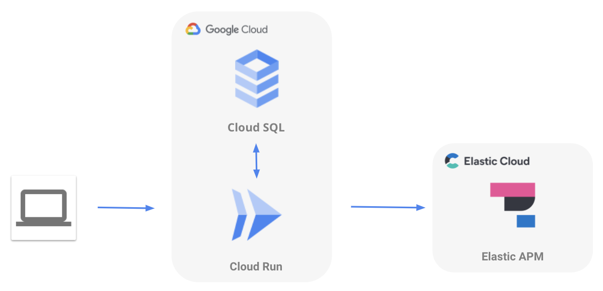

## Deploying to Cloud Run

### Creating Cloud SQL for MySQL instance

Create a Google Cloud MySQL instance from the [Google Cloud Console Cloud SQL](https://console.cloud.google.com/sql/instances) page. 

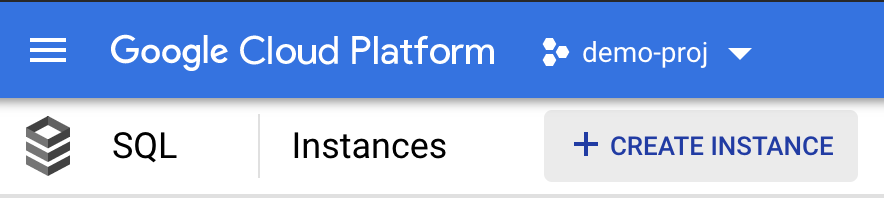

Click on the new instance and choose MySQL.

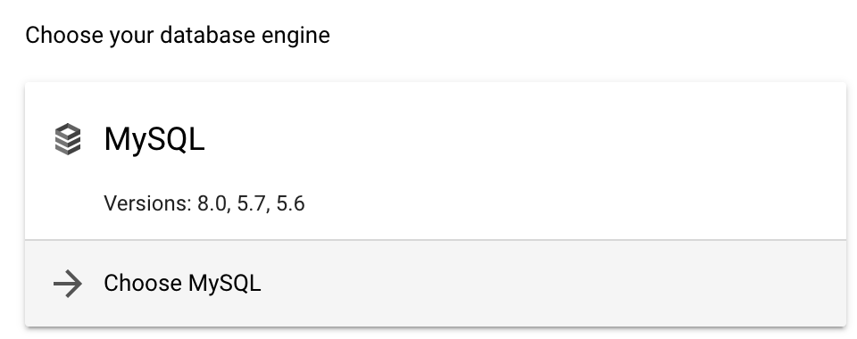

Give an "Instance ID," something like `attendance-db` and click on "generate" to generate a password. This will be used later to connect to the database instance. Choose the region of your choice. I've chosen the Single zone as it is for a demo. It is recommended to have DB in mutliple zones. I went ahead with the default memory, CPU, storage options provided.

Click on the database name you have created and navigate to the "Databases" menu. Create a database. That we could use in the application. 

Note the database name, connection name, generated password. We will use it in our application to connect with the database instance. 

## Building Spring Boot Application

Note: I used the Google Cloud Shell + Google Cloud Code extension to deploy the containerized app to simplify the deployment process. You can use VS Code and Cloud Extension from your own laptop and connect to Cloud SQL, but you need to configure the account's private key on your local file system, prepended with `file:` 

Log in to Google Cloud Platform (GCP) and click on Cloud Shell on the top right.

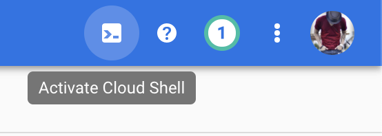

Cloud Shell helps you to manage your infrastructure and develop applications from any browser. Cloud shell also comes with pre-installed tools like MySQL, kubectl, Docker, Minikube. 

Once Cloud shell gets up and running, make sure you set the right GCP project for deploying the code. 

```json
gcloud config set project [PROJECT_ID]
```

Click on "Open Editor" in the Cloud Shell. This editor is an OSS project called [Theia-IDE](https://theia-ide.org/) which looks very similar to [VS Code](https://code.visualstudio.com/) 😉 We'll build and deploy the code using Cloud editor. Just like Cloud shell, it comes with all the VSCode extensions. 


Clone the repository to the workspace by using the cloud shell or by creating a new terminal. You will get a finished project by cloning the below repo. You just need to add the relevant configuration details. 

```json
git clone https://github.com/aravindputrevu/elastic-cloud-samples/elastic-apm/cloud-run-sql
```

### Dependencies

[Spring cloud GCP](https://spring.io/projects/spring-cloud-gcp) project enables developers to easily integrate spring applications into GCP. 

There are many integrations offered under the Spring Cloud GCP umbrella. 

It is recommended to add the below dependency. It will help you manage the version numbers of `spring-cloud-gcp` dependencies in your project.

```xml
<dependencyManagement>
   <dependencies>
       <dependency>
           <groupId>org.springframework.cloud</groupId>
           <artifactId>spring-cloud-gcp-dependencies</artifactId>
           <version>2.0.2</version>
           <type>pom</type>
           <scope>import</scope>
       </dependency>
   </dependencies>
</dependencyManagement>
```

Spring Cloud GCP offers starter dependencies through Maven to easily depend on different library modules. 
`spring-cloud-gcp-starter-sql-mysql` lets us connect to [Cloud SQL for MySQL](https://cloud.google.com/sql).

```xml
<dependency>
        <groupId>org.springframework.cloud</groupId>
        <artifactId>spring-cloud-gcp-starter-sql-mysql</artifactId>
</dependency>
```

### Configure  Cloud SQL for MySQL

Provide the database name, instance-connection-name, password from the previous step in `application.properties`. 

> Tip: Instance connection name can be found in GCP Cloud SQL page be in the format
`<project-name>:<region>:<database-instance-name>`

```json

spring.cloud.gcp.sql.database-name=
spring.cloud.gcp.sql.instance-connection-name=
spring.datasource.password=
```

## Configure Elastic APM

Create an [Elastic Cloud Account](https://cloud.elastic.co/registration) -> Observability Deployment. You can refer to [my guide with screenshots on account creation](https://aravind.dev/elastic-cloud-apm). 

[Download](https://search.maven.org/search?q=g:co.elastic.apm%20AND%20a:elastic-apm-agent) the latest Elastic Java APM agent to root (`cloud-run-sql`) folder of the application. Rename `elastic-apm-agent-1.23.jar` to `elastic-apm-agent.jar`

> Note: Don’t declare a dependency to the agent in your application.

Copy the APM server URL and Secret token; paste in the `elasticapm.properties`

```json
service_name=attendance-tracker
application_packages=cloudcode.helloworld
server_url=
secret_token=
```

### Building a Docker Container

Below Dockerfile is already available in the repository cloned. 

```docker
# Using the official maven/Java 11 image to create a build artifact.
# https://hub.docker.com/_/maven
FROM maven:3-jdk-11-slim AS build-env

# Set the working directory to /app
WORKDIR /app

# Copy the pom.xml file to download dependencies
COPY pom.xml ./
# Copy local code to the container image.
COPY src ./src

# Download dependencies and build a release artifact.
RUN mvn package -DskipTests

# Use OpenJDK for base image.
# https://hub.docker.com/_/openjdk
# https://docs.docker.com/develop/develop-images/multistage-build/#use-multi-stage-builds
FROM openjdk:11-jre-slim

# Copy the Elastic APM jar to the production image.
COPY elastic-apm-agent.jar /

# Copy the properties file for the APM jar to recognize.
COPY src/main/resources/elasticapm.properties /

# Copy the jar to the production image from the builder stage.
COPY --from=build-env /app/target/student-attendance-*.jar /student-attendance.jar

# Run the web service on container startup.
CMD ["java", "-javaagent:elastic-apm-agent.jar", "-jar", "/student-attendance.jar"]
```

### Deploying Application via Cloud Code

Cloud Code is a VS Code Extension that helps you to deploy to Google Cloud Platform Services. In this case, we're using it to deploy to Cloud Run. 

*Note:* The editor we opened earlier contains cloud code by default. 

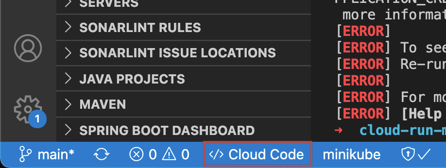

It will build the container image, push it to the Google Cloud Container Registry, eventually deploying to Google Cloud Run. 

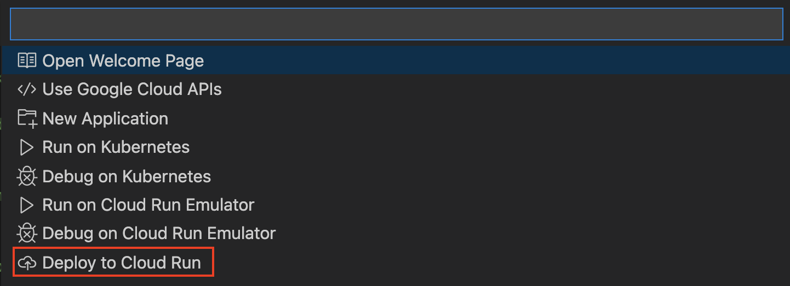

Create a service, choose a region you want to deploy the container.  

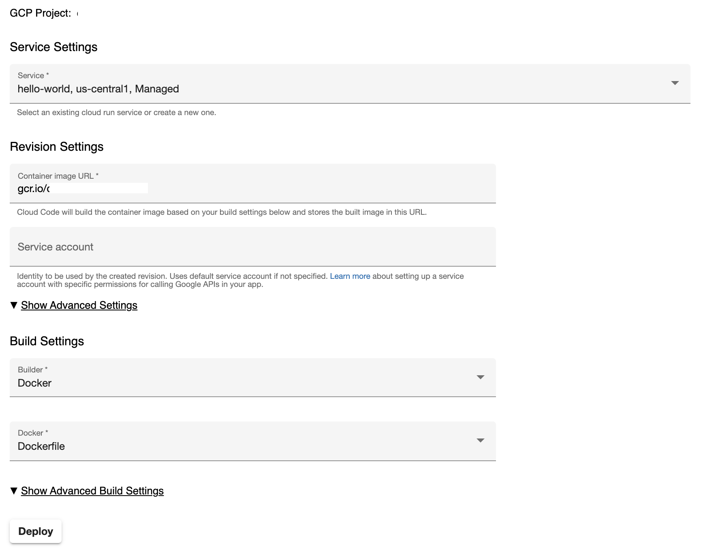

Once the container is built and deployed, you will get an URL. Every Cloud Run service gets a `*.run.app` domain name for free. 

### Analysing Application Metrics via Elastic APM in Kibana

As we configured the application to send traces, head over to Kibana → APM to view everything happening in your application. 

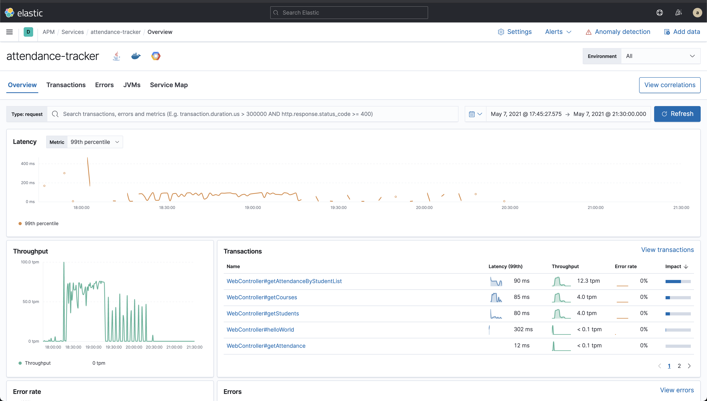

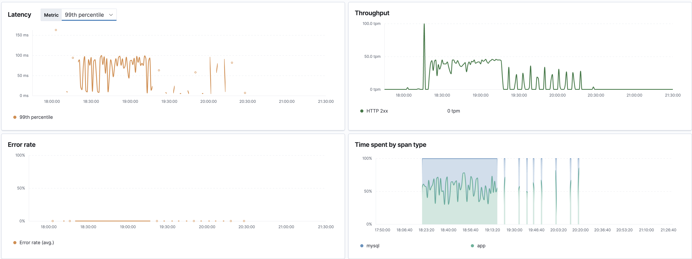

Tracing enables us to collect request spans and which method is responding slow. 

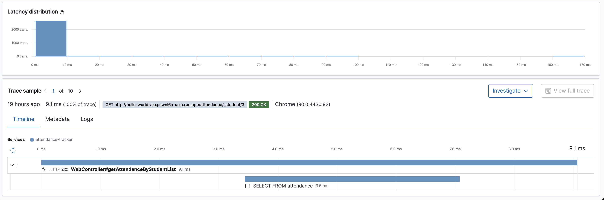

Watch how the java heap is occupied by the application as well as the garbage collection cycle!

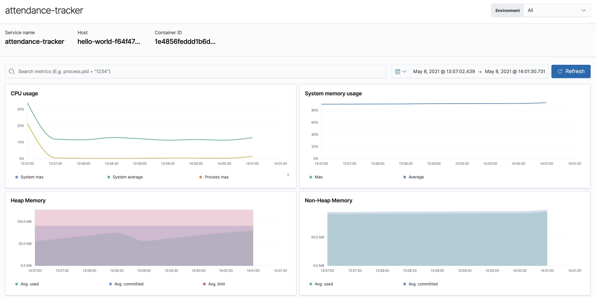

The application logs are shipped to Google operations (previously Stackdriver). Suppose you can ingest them via [filebeat google cloud module](https://www.elastic.co/blog/monitoring-google-cloud-with-the-elastic-stack-and-google-operations). In that case, you could simply correlate the logs, metrics, and traces from the infrastructure. 

### Tear Down

 Execute the below commands to delete the cloud run container deployed and the Cloud SQL instance.

```docker
gcloud run services delete [SERVICE_NAME]
```

```docker
gcloud sql instances delete [INSTANCE_NAME]
```

## Congratulations

Congratulations, you've successfully built a container serverless app deployed it in the cloud! 

In this lab, you have successfully learnt 

- Creating Google Cloud SQL instance.
- Built a Spring Cloud MySQL app.
- Configured Tracing on Java Application. 
- Deploy the containerized serverless application to Google Cloud Run.

### Reference docs
- [Youtube video of on how to use Cloud shell](https://www.youtube.com/watch?v=PwY4UtMvLAE)
- [Git Repository](https://github.com/aravindputrevu/elastic-cloud-samples/elastic-apm/cloud-run-sql)
- [Elastic APM Documentation](https://www.elastic.co/guide/en/apm/index.html)
- [Java Agent Supported Technologies and Frameworks.](https://www.elastic.co/guide/en/apm/agent/java/current/supported-technologies-details.html)
- [Other Programming Language Elastic APM Agents.](https://www.elastic.co/guide/en/apm/agent/index.html)

### Further Reading
Check out some of these blogs...
- [Monitoring a Java App](https://www.elastic.co/blog/monitoring-java-applications-and-getting-started-with-the-elastic-apm-java-agent)
- [Kubernetes Observability Tutorial](https://www.elastic.co/blog/kubernetes-observability-tutorial-k8s-monitoring-application-performance-with-elastic-apm)
 


