## Introduction

### What is App Search?


App Search contains robust developer APIs and people friendly dashboard controls.It powers search for thousands of popular and delightful applications around the world and it's backed by [Elasticsearch](https://github.com/elastic/elasticsearch).
Ready to see it in action? Let's get going

### What you’ll build
In this codelab, you're going to build a movies search engine app using Python Flask. 
Your app will:

- Use Elastic App Search, so it works on desktop or mobile.
- Be fast, simple and providing a reliable way to query the information.
- You will also be able to tune the results in a way to suit your need of your user.

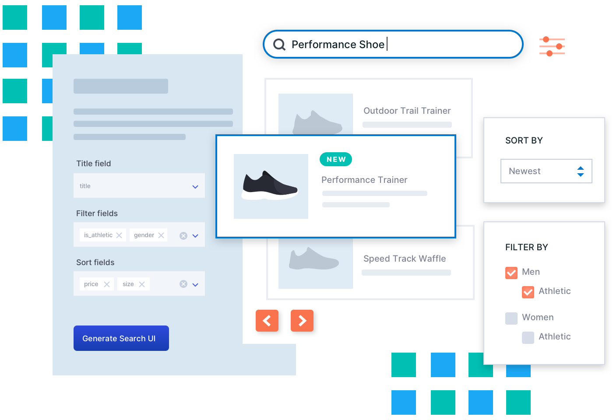

> Note: To simplify this guide, and explain the fundamentals, we’re using Elastic App Search via Elastic Cloud Platform. 


### What you’ll learn
- How to create a Elastic App Search Instance in Cloud.
- Navigating to the Admin Console
- Ingesting Data
- Creating a Search Experience with Python Client
- Deploy it on a Cloud platforms
- What you’ll need
- A recent version of Chrome/Firefox/Edge.
- Visual Studio Code.
- A free Account on Azure. You can create one [here](https://azure.microsoft.com/en-us/free/).

Elastic Cloud is hosted Elastic Stack (Elasticsearch, Kibana, Beats, Logstash are called as Elastic Stack) as a service. Elastic Cloud offers Search, Observability, Security as a Service. 

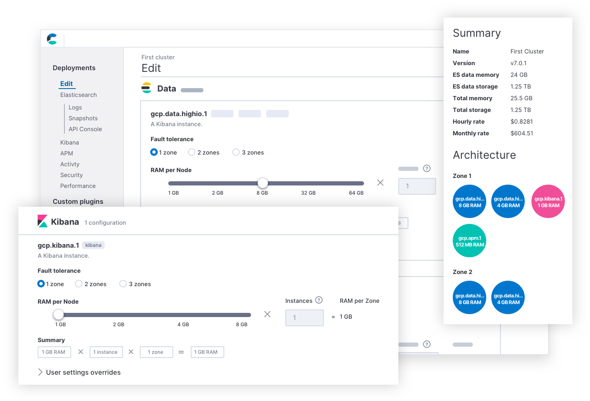

In this lab, we’re specifically looking at Elastic Enterprise Search which is the umbrella solution for App Search and Workplace Search.

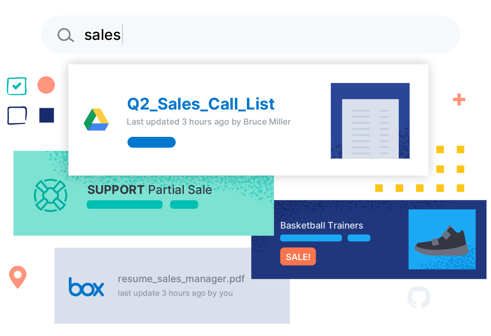

> **Note:** You can also download Elastic Enterprise Search from elastic.co/downloads

## Elastic Cloud

### Creating an account in Elastic Cloud

Go to https://ela.st/dev-dish and create an account. After logging in, you will see below screen.

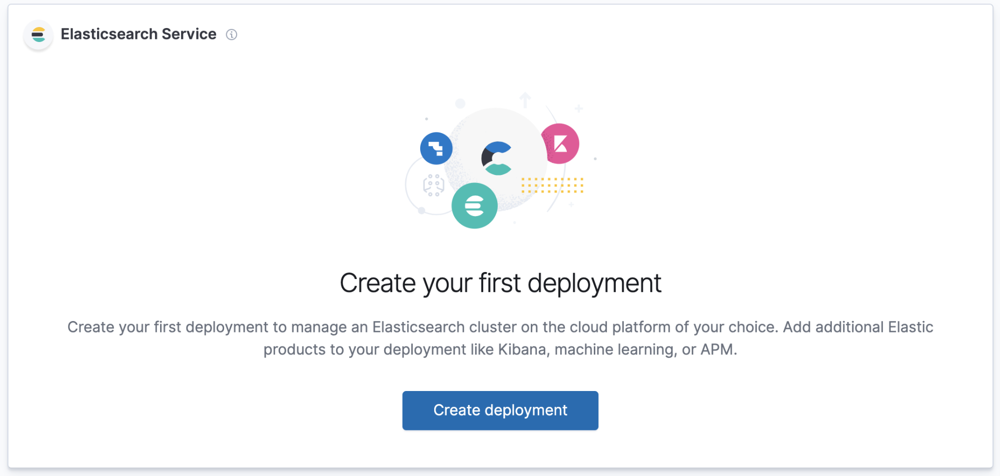

Click on the “Create Deployment”

Elastic Cloud is available on AWS, GCP, Azure cloud platforms. 

Give a name to your deployment, select the cloud platform and region you want to deploy the solution.Choose Elastic Stack Version (preferably the latest one), finally, select “App Search”. 

There are many ways to edit this deployment but for now, click on “Create Deployment”.

> **Caution:** Save your App Search Username and Password.These credentials provide owner access to your App Search deployment. The password won’t be shown again. You’ve to reset it from Security settings. 

It takes few minutes to deploy the solution on to the selected cloud and region. Click “View your deployment” after the deployment completed. You should be able to this. 

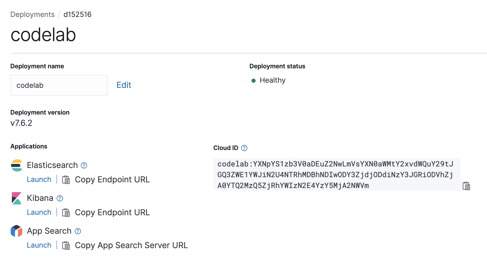

Click on “Launch” link under the Enterprise Search. It takes you to the page to choose App Search console, where we ingest data and create the search experience. 

### Creating a Search Engine

You will see below screen after selecting the Elastic App Search. Data is ingested into the  Search engine. You will query the Search engine created here. 

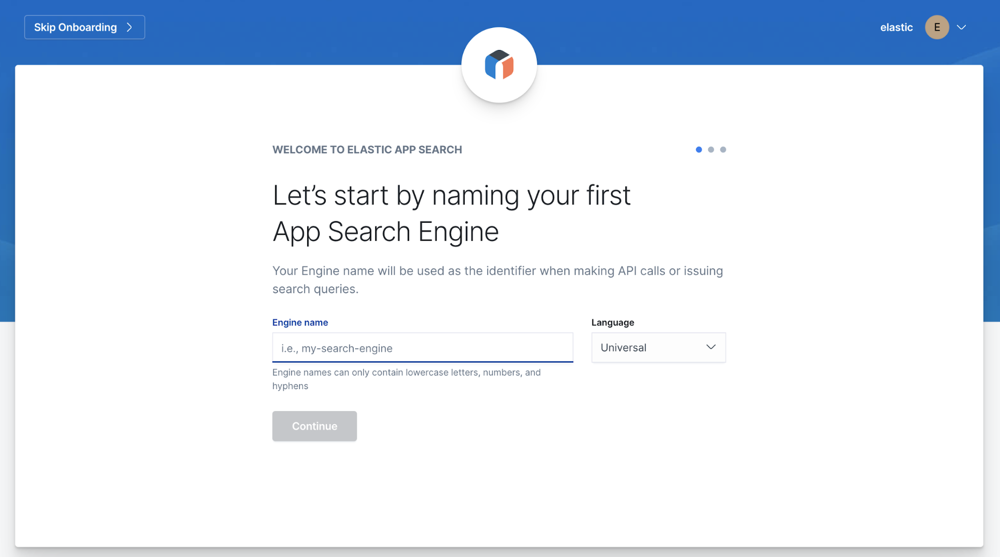

> Tip: You can create multiple search engines, search multiple engines. It is called Meta Engines.

## Ingesting  Data into Search Engine

### About Dataset

In order to create a search experience we need data to ingest into App Search. App Search can be used to for wide variety of data. For example you can ingest data like movies, restaurants, recipes, dishes, various products and create a search experience. 

For this lab, we will use the [movies dataset](https://www.dropbox.com/s/f3a210ts0dlrk26/bollywood-movies.json?dl=0). 

### Ways to Ingest Data

There are two ways to ingest data in App Search

1. Data upload UI in the App Search Console
2. App Search API 

#### Data Upload UI

App Search shows a getting started (onboarding) experience when you are accessing App Search for the first time.

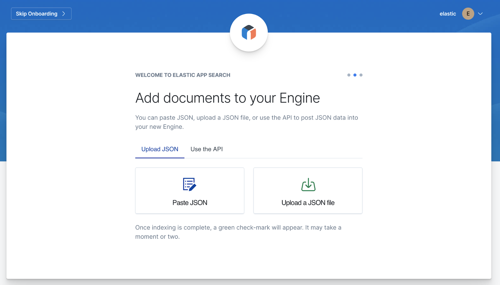

Paste JSON in the text box popup or upload the JSON, but it accepts only data less than 102400 bytes. [Download this dataset](https://www.dropbox.com/s/f3a210ts0dlrk26/bollywood-movies.json) and paste some JSON documents. 


After clicking “continue”, you should see below screen. 


#### App Search API

Alternatively, you can click on “Use the API” and use a tool like cURL.

```json
$ curl -X POST 'https://<app-search-#>.elastic-cloud.com/api/as/v1/engines/movies/documents' \
 -H 'Content-Type: application/json' \
 -H 'Authorization: Bearer private-<key>' \
 -d '[
   {
  "title_x": "Uri: The Surgical Strike",
  "imdb_id": "tt8291224",
  "poster_path": "https://upload.wikimedia.org/wikipedia/en/thumb/3/3b/URI_-_New_poster.jpg/220px-URI_-_New_poster.jpg",
  "wiki_link": "https://en.wikipedia.org/wiki/Uri:_The_Surgical_Strike",
  "title_y": "Uri: The Surgical Strike",
  "original_title": "Uri: The Surgical Strike",
  "is_adult": 0,
  "year_of_release": "2019",
  "runtime": "138",
  "genres": "Action|Drama|War",
  "imdb_rating": 8.4,
  "imdb_votes": 35112,
  "story": "Divided over five chapters  the film chronicles the events of the surgical strike conducted by the Indian military against suspected militants. It tells the story of the 11 tumultuous events over which the operation was carried out. Indian army special forces carry out a covert operation to avenge the killing of fellow army men at their base by a terrorist group.",
  "summary": "Indian army special forces execute a covert operation  avenging the killing of fellow army men at their base by a terrorist group.",
  "tagline": "",
  "actors": "Vicky Kaushal|Paresh Rawal|Mohit Raina|Yami Gautam|Kirti Kulhari|Rajit Kapoor|Ivan Rodrigues|Manasi Parekh|Swaroop Sampat|Riva Arora|Yogesh Soman|Fareed Ahmed|Akashdeep Arora|Kallol Banerjee|",
"wins_nominations": "4 wins",
  "release_date": "11 January 2019 (USA)"
  }    
]'
```

## Securing App Search

App Search comes with inbuilt authentication mechanism.


> Tip: A Public Search Key and a Private API Key are generated when you create a new account.          By default, they can access all Engines. If you do not want to use the default keys, feel free to delete them.

### API Keys

API Keys come in four different types:

- **Public Search Key:** The default API reading key has read-only 'search' access to the Search endpoint. You can reveal this key to the public. Prefixed with `search-`.<br/><br/>
- **Private API Key:** The default API access key can read and write against all available API endpoints except for Credentials. You should keep this key secret. Prefixed with `private-`.<br/><br/>
- **Private Admin Key:** A special account management key that is used to request against the Credentials endpoint. You should keep this key very secret. Prefixed with `admin-`.<br/><br/>
- **Signed Search Key:** A more restrictive public key to query the Search endpoint resources. It is a JSON Web Token signed using a read only Private API Key by the HMAC-SHA256 algorithm. Signed search keys are created using one of our clients. They require an existing Private API key with read access. 

| Key Type      | API Access                 | Write                  | Read Documents      | Engine Access  |
|---------------|----------------------------|------------------------|---------------------|----------------|
| Public Search | Search API                 | No                     | Yes                 | Yes            |
| Private API   | All, except Credential API | Yes                    | Yes                 | Yes            |
| Private Admin | Credential API<br>only     | Credential API<br>only | Credential API only | Not Applicable |

## Exploring App Search Console

App Search comes with a host of Speciality Search features. We’ll take a look at some of them here. Otherwise, feel free to explore the menu.

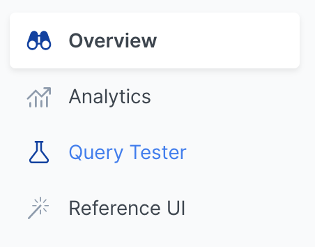

**Overview** lets you take a look at # of documents, click rate, API events. 

**Analytics** displays various metrics of the Search Engine, like what users were searching, top queries with clicks  and queries with no results shown etc.


**Query Tester** is an easy way to test your queries and check the relevancy score. Place where you can tune your results for the users. 

**Reference UI** will help you get your next search experience rolling as quickly as possible.
You can see a live preview of your Engine and configuration state, or use the [open source code](https://github.com/elastic/app-search-reference-ui-react) to get started. It is a react based generic UI that gets generated with the configuration you have set in the console. 

> Note: [Open source reference UI](https://github.com/elastic/app-search-reference-ui-react) react based bare bones app to build any search application. We also have a [headless core](https://github.com/elastic/search-ui/blob/master/ADVANCED.md#headless-core) that you could use it for building  any Javascript applications.

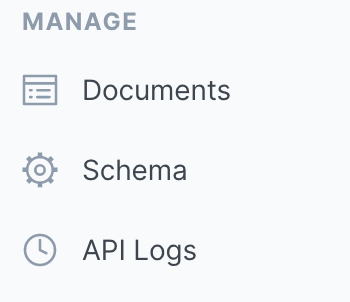

**Schema** helps you to define and update the document’s field data structure.  You can  simply choose what the document type to be even after indexing the data.

**Documents** lets you browse and view various fields. If you want index some more data, you can leverage the index documents button to either paste or upload the JSON data.

**API Logs** shows you the API’s called by the client in app search, you can notice the browser used, error code etc. 

## Creating a Search Experience

We’re gonna use  Flask as our framework for building a Python web application. Please clone the git repository using the commands below. 

```bash
$ git clone https://github.com/aravindputrevu/app-search-flask-app

$ cd app-search-flask-app
```

### Building Basic Flask App

Let us switch to a different where you can find a barebones Flask Web App.

> Caution: Make sure you have Python installed. Preferably 3.x. 

```bash
$ git checkout basic-flask-app

$ python main.py
```

Go to http://localhost:5000


`main.py` contains the code for the application. 

### Integrating App Search

Quickly move over to add-app-search branch where integrate Web App with Elastic App Search.

```bash
$ git checkout add-app-search
```

Open `config.json` file in your file editor(preferably vscode) and fill out the `base_endpoint`, `api_key`, `engine_name`  from Elastic App Search Console. 

> Note: You should remove `https://` and suffix `base_endpoint` with `/api/as/v1` to the URL

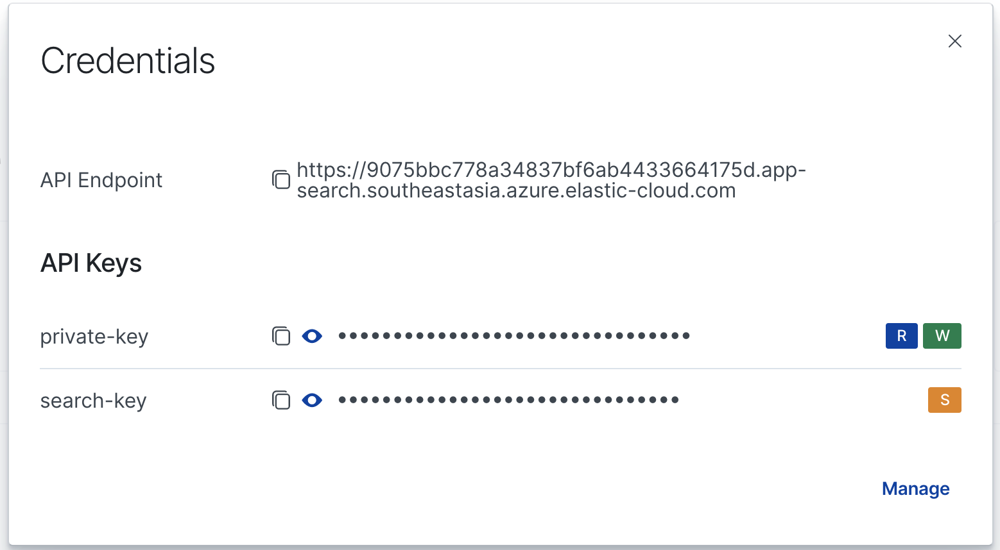

In the `main.py`, we have imported the app search python client and instantiated the client with the credentials configured. 

```python
from elastic_app_search import Client
 
client = Client(
   base_endpoint=config['appsearch']['base_endpoint'],
   api_key=config['appsearch']['api_key'],
   use_https=True)
```

We’ve also created two HTTP endpoints  `/search`,  `/index`. While the search endpoint helps you to interact with the Search engine, Index helps you to do one time data indexing to the search engine using `data.json` file.

Run the application using below command

```bash
$ python main.py
```

Go to http://localhost:5000 and index the data using http://localhost:5000/index which will index the sample data into search engine.  

You should be able to see the movie data. 

Now try searching with different terms like `drama`, `action` and see the results.

### Tweaking the Search

 Interesting thing with App Search is you can configure your search engine real time without any code change or restarting your application. 

Features like Relevance Tuning, Synonyms & Curations help curate Search experience for the user simply. 

Let us try and change some settings. 

#### Relevance Tuning

The true goal of a search engine is to connect you with useful information as quickly as possible. Relevance Tuning helps you to show accurate results to the users. 

With a dataset like movies, users generally search for the movie title along with the year or actor. We could use the relevancy tuning to set the right weights and boosts so that accurate  results are shown.


> Note: Make sure you test the queries in the query tester for optimal results after changing relevancy.   

#### Synonyms

Synonyms relate queries together that contextually have the same meaning in your dataset.Sometimes users will use different terminology than your context might expect.
This can lead them to poor search relevance: you are selling movies, but they want films!


#### Curations

You are the curator of your Engine. You are in control of how documents are consumed by your visitors.
A curation helps people discover what you would most like them to discover. Or, what you would not like them to discover. 
Use a keyword like “drama” to find the results and promote or hide the documents  appearing in the results. Curations can promote specific documents to have them appear in a prominent way.


## Deploying Application to Cloud

### Containerize the Application

Containerizing the application helps us to deploy on any platform or cloud container service like AKS, GKE or even managed services like Google App Engine, Azure App Service. 

Let us switch over to the `docker` branch.

```bash
$ git checkout docker
```

You should see `Dockerfile` and `docker-compose.yml` which helps build a container for the application. [Visual Studio Code Docker Extension] (https://code.visualstudio.com/docs/containers/overview) can help you to build Dockerfile for the application. 


Try running the application from Visual Studio Code using the Run option as shown in the picture below. 

> Note: You could also generate the Dockerfile with the config according to your choice by using command palette  cmd+shift+p (mac) or ctrl+shift+p (windows) & typing “Docker: Add Docker Files to Workspace”

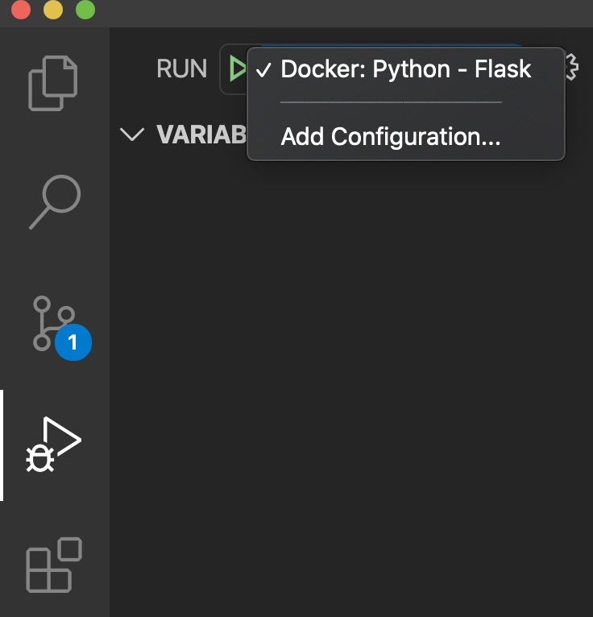

As you run the application, it opens up in the browser on a random port. Play with the application and see if  you are getting similar results as before. 

### Pushing Container to Cloud

The main benefit of containers is their ability to build once, run anywhere. Best practice to store a container in a container registry like Docker Hub. We also have container registries from Cloud platforms (Azure Container Registry, Google Container Registry). 

In this lab, we would push the container to the Azure container registry directly using the Docker Extension in Visual Studio Code editor.  All that you need to have is Docker VS Code Extension installed and configure Azure Container Registry(ACR). 

A container registry is nothing but a store for all your containers for various application builds.  You can also consider it like a docker hub equivalent except for the fact, it is yours with a specific name like `aravind.acr.io`

Just use the “plug” icon on the registries to connect the Azure Container registry(image for reference) 


Invoke the command palette using `CMD+Shift+P` and build-push the container to ACR using “Azure Container Registry: Build Image in Azure…” 


Tags you container with a specific name, leave as it is if you are ok with the default name. 


You will need to create a container registry with a unique identifier (ex: your last name) if one doesn’t populate automatically. Click on `+Create new  registry...` , select a SKU (Basic), Resource Group name, location (Southeast Asia). 


Choose your choice of container image(Linux). 

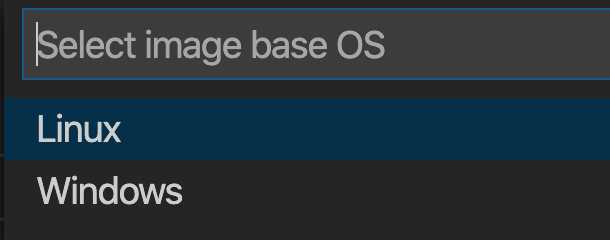

Once the build completes you should be able to see a container in registry. You can check in [Azure Portal](https://portal.azure.com) or VS Code Docker Extension pane (Images below for reference).

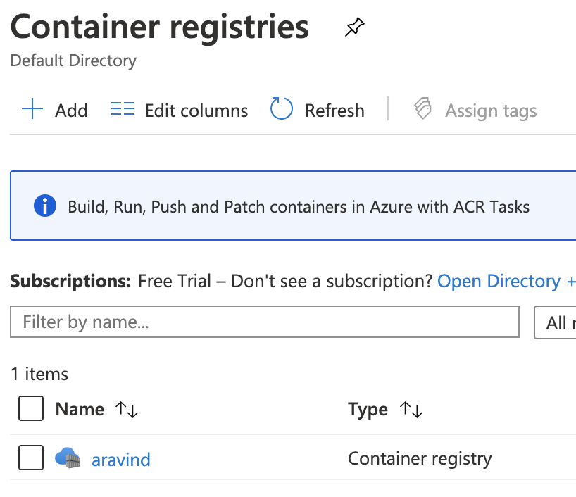

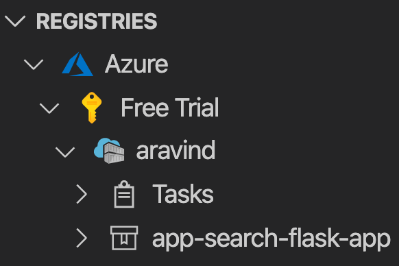

> Note: Azure Services used in this guide are in free tier. 

### Deploying App to Azure App Service

Azure App Service is a fully managed platform for building, deploying and scaling web apps and you can run it in free tier. 

Install the Visual Studio Code [Azure App Service](https://marketplace.visualstudio.com/items?itemName=ms-azuretools.vscode-azureappservice) extension to be able to easily deploy the container in the Azure App Service. 

Installing this extension adds a App Service deployment option in Docker Extension in VS Code. Quickly move to the Docker pane in VS Code, locate the container we built in Azure registry and right click on it. You should be able to see “Deploy Image  to Azure App Service…” option (image for reference). 


Click on the “Deploy Image to Azure App Service...” and follow the 6-step wizard to create the webapp. 


Make sure you enter a unique name for the web application, this will be the go to URL for the users. 


Step 2, you should create a App Service plan to deploy the web application. It is quite simple. Follow the images for reference, I’ve chosen F1 Free as pricing tier and Southeast Asia as my location to deploy the application (Images for reference).


Finally the application is live. You can confirm the same either via popup shown in VS Code. If not in the terminal (Images for reference).


> Note: Alternatively, you can also deploy the container in services like AKS, GKE, Azure Container Instances, Cloud Run etc.


## Congratulations

Congratulations, you've successfully built a Python Web Application with Search functionality and deployed it in the cloud! 

In this lab, you have successfully learnt 

- Creating and Deploying a Search Engine
- Tuning Search Results with Synonyms, Curations.
- Containerize a Python Web Application. 
- Deploy the containerized web application to Cloud Service.

### Reference docs
- [Youtube video of this guide](https://www.youtube.com/watch?v=gVtQ42Fp_v8)
- [Git Repository](https://github.com/aravindputrevu/app-search-flask-app)
- [Elastic App Search Documentation](https://www.elastic.co/guide/en/app-search/current/index.html)

### Further Reading
Check out some of these blogs...
- [Build a react based Search App](https://www.elastic.co/blog/how-to-build-application-search-with-react-and-elastic-app-search)
- [About App Search Analytics](https://www.elastic.co/blog/what-your-elastic-app-search-analytics-are-telling-you)
 

