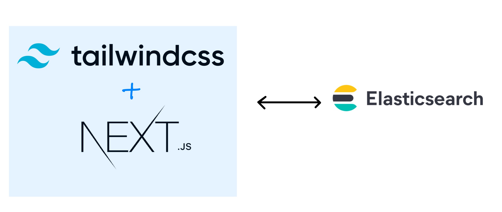
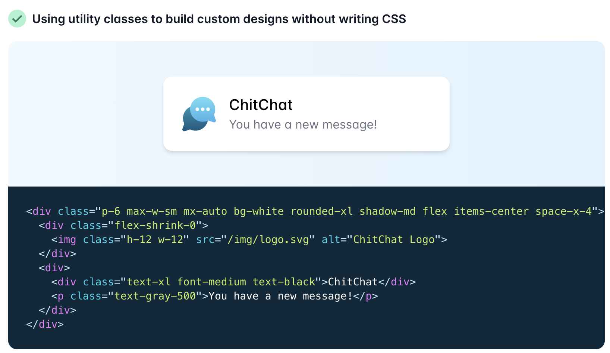
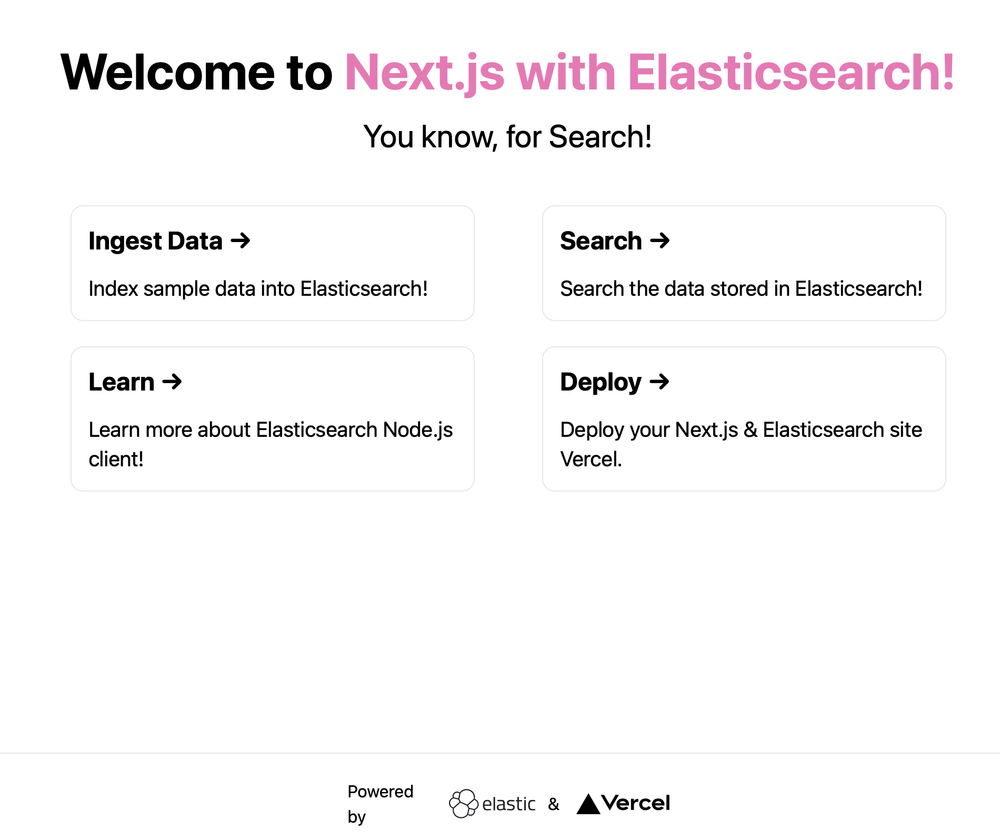
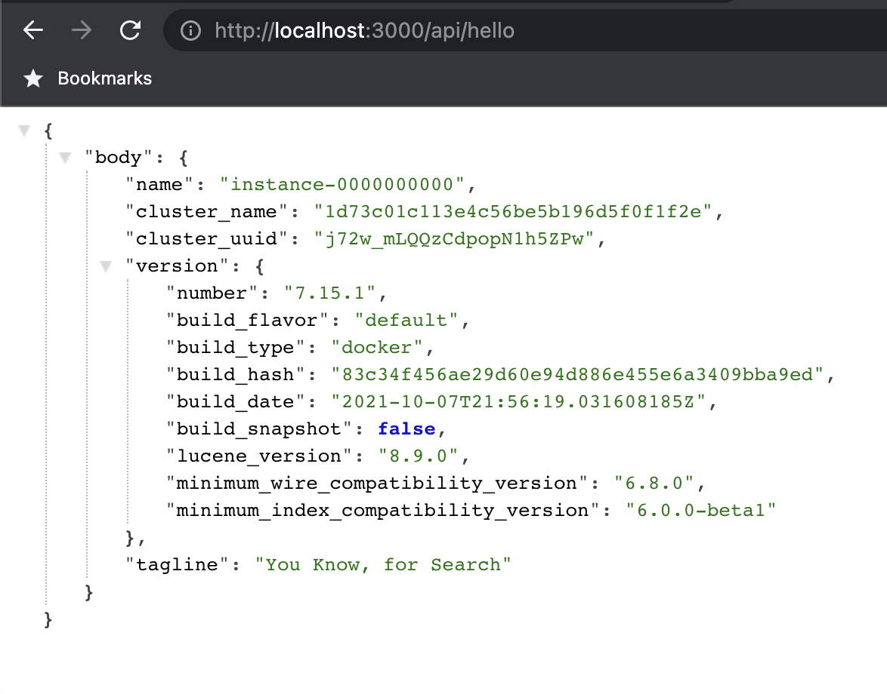
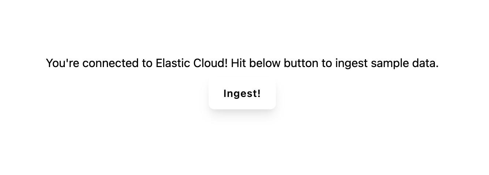
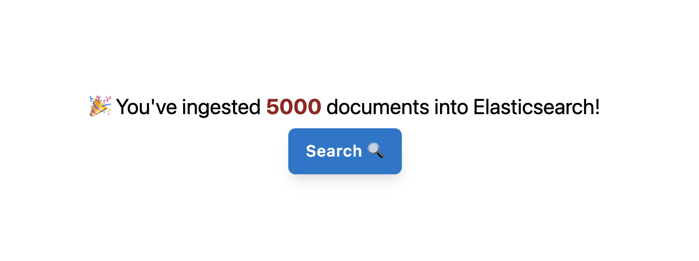
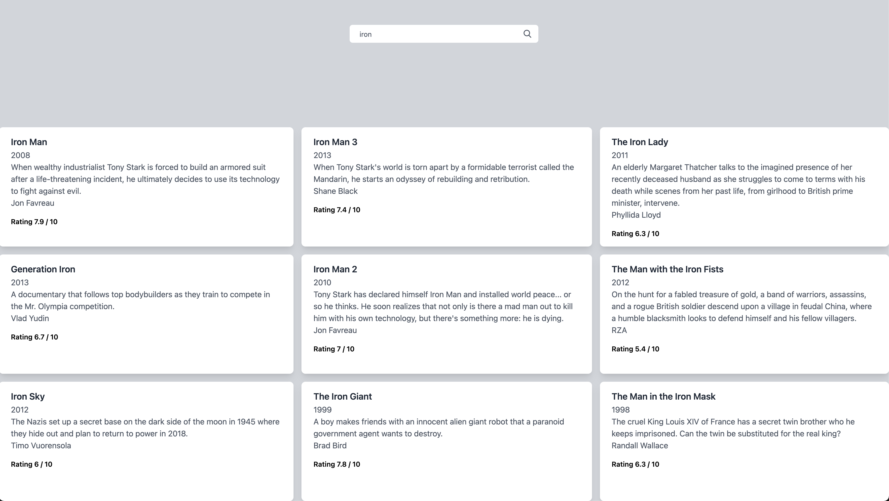

In this tutorial, we will build a simple search engine using [Elasticsearch](elastic.co/elasticsearch), [Next.js](https://nextjs.org/), and [TailwindCSS](https://tailwindcss.com/). 

I want to build a search engine with React-based application and frankly window-shopped a lot of JS frameworks, finally settling on _Next.js_. 

Initially, I thought of using a CSS framework like [Spectre](https://picturepan2.github.io/spectre/). But then I want to give _tailwindcss_ a shot. It turned out to be impressive, and I gained a new skill. 

As a backend dev with a Java/GoLang background, someone who worked on [EJB's](https://docs.oracle.com/javaee/5/tutorial/doc/bnblt.html) 😃 it feels super cool to create beautiful user interfaces.



## Installing and configuring Next.js, TailwindCSS

We will be using below git repo throughout the guide. It has numbered branches for you to follow. Names indicate the code/feature in that branch. Run `npm install` to install all dependencies, including 
Next.js.

```bash
git clone https://github.com/aravindputrevu/nextjs-tailwindcss-search.git
git switch 1-initial
```

> **Note:** Nodejs and NPM need are prerequisites, you can install them from here. You can the version of nextjs installed with `npx next -v`.

### NextJS

NextJS is a framework built on top of [ReactJS](https://reactjs.org/), another popular framework for writing Javascript-based web applications. To understand more about Next.js and its features, please refer to [Next.js documentation](https://nextjs.org/docs/getting-started). It is exhaustive and has excellent developer experience.

### TailwindCSS 

If you have checked out the `package.json` in the repo above, it comes with the dev dependency - tailwindcss. TailwindCSS is a utility-first CSS framework, which helps you to build responsive UI experiences. 

In simple terms, you don't need to write a CSS classes or customize them. Instead you choose it from a set of pre-defined CSS classes from TailwindCSS. You might be wondering, how much Tailwindcss can be of your help, you can customize tailwindcss to adapt to your own brand. 



That being said, the framework is big and you would need the help of other libraries like postcss to remove those classes which are not used and generate a CSS file which is only used by your app. 

I'm using the latest Just-in-time (JIT) compilation mode of TailwindCSS which eliminates the postcss step. 

Want to read more? Refer tailwindcss documentation on adding [Tailwindcss to Next.js](https://tailwindcss.com/docs/guides/nextjs).

### Hello, world!

I hope you are in the `1-initial` branch of git repository. Do switch to below branch get started!

Run the below command to see the app at http://localhost:3000

```bash
npm run dev
```



> Note:  To generate a production build, run `npm run build` and `npm run start`. 

## Creating and connecting to an Elasticsearch Cluster

To ingest data and search, we need to create an Elasticsearch cluster. You could download and run [Elasticsearch directly](https://elastic.co/downloads/elasticsearch/) as it is a free and open distributed search engine, analytics store. 

We will be using [Elastic Cloud](https://elastic.co/cloud) here as a backend. First, create a [free Elastic Cloud Account](https://cloud.elastic.co/registration) -> spin up Elastic Stack Deployment. For more information, refer to my [guide with screenshots](https://aravind.dev/elastic-cloud-apm) on account creation.

```bash
git switch 2-connect-es
```
To communicate with Elasticsearch via a Next.js app, you can use a language client which wraps all the APIs in the respective programming language. Elastic has language clients for most of the [programming languages](https://www.elastic.co/guide/en/elasticsearch/client/index.html). 

In the `lib` folder, I'm adding a file named `elasticsearch.js` which will import the necessary dependency. 

```js
import { Client } from '@elastic/elasticsearch'

export async function connectToElasticsearch() { 

    const ESS_CLOUD_ID = process.env.ESS_CLOUD_ID
    const ESS_CLOUD_USERNAME = process.env.ESS_CLOUD_USERNAME
    const ESS_CLOUD_PASSWORD = process.env.ESS_CLOUD_PASSWORD

    if (!ESS_CLOUD_ID || !ESS_CLOUD_USERNAME || !ESS_CLOUD_PASSWORD)
    {
        return "ERR_ENV_NOT_DEFINED"
    }

    return new Client({
        cloud: {
            id: ESS_CLOUD_ID,
        },
        auth: {
            username: ESS_CLOUD_USERNAME,
            password: ESS_CLOUD_PASSWORD,
        }
    })
}
```

> **Note:** You need to configure the ESS_CLOUD_ID, ESS_CLOUD_USERNAME, ESS_CLOUD_PASSWORD in the `.env.local` file. A sample is present in the repo as `.env.local.example`.

You might think that Next.js is a frontend framework, but it can also work as a backend for your APIs. Let us test the connection using a sample API `hello.js` in the `api` folder. 

```js
import { connectToElasticsearch } from "../../lib/elasticsearch"

export default async function hello(req, res) {
    const client = await connectToElasticsearch()
    const { body } = await client.info()
    res.status(200).json({body})
    
  }
```

Run the below command to query the API at http://localhost:3000/api/hello

```bash
npm run dev
```



## Creating Next.js pages, API routes, Ingesting Data

In this step, we will create an `ingest` page and a API route. But, first, let us switch to the `3-pages` branch using the below command. 

```bash
git switch 3-pages
```

Notice that we have two new files, `ingestData.js` and `search.js` under the `api` folder and `ingest.js` file directly under the `pages` folder. It is so simple and easy to create pages and API routes on Next.js. 

Now, if you run the `npm run dev`,  you can see the page accessible at `http://localhost:3000/ingest`.



Hit that `ingest` button to ingest the sample data. We will be ingesting `5000` documents from a movie JSON dataset into Elasticsearch using the `_bulk` API.  We are calling `ingestData` API in the app to trigger the below code. 
 
```js
export default async function ingestData(req, res) {
  
    const split = require('split2')
    const client = await connectToElasticsearch()
    await client.helpers.bulk({
        datasource: createReadStream('./movies.json').pipe(split()),
        onDocument (doc) {
          return {
            index: { _index: 'my-index' }
          }
        },
        onDrop (doc) {
            console.log(doc)
          }
      })
    
    res.redirect('/ingest')
    
  }
```



> **Note:** `movies.json` is already available in the checked-out repo.

## Creating a Search UI 

In the final step, we will create a search box that takes our query and searches across the movie dataset. 

Let us take a look at the search API through which we will query the data.

```js
export default async function search(req, res) {

    const client = await connectToElasticsearch()
    const query = req.body
    const { body } = await client.search({
    index: 'my-index',
    body: {
        query: {
            match: {
            title: query
            }
        }
    }
    })
    let searchResults = body.hits.hits
    res.status(200).json({searchResults})
  }
```

We are using a simple Elasticsearch match query here. Depending on your use case, you could replace that with your choice ([match_phrase](https://www.elastic.co/guide/en/elasticsearch/reference/current/query-dsl-match-query-phrase.html), [term](https://www.elastic.co/guide/en/elasticsearch/reference/current/query-dsl-term-query.html), etc.) depending on your use case. To read more about [QueryDSL](https://www.elastic.co/guide/en/elasticsearch/reference/current/query-dsl.html), do refer to the official documentation of Elasticsearch. 

Switch to the below branch to see the final codebase, where we have a `search.js` page with a search bar UI to search across all the movies. 

```bash
git switch 4-search-ui
```


## Conclusion

It felt so simple for me to kick start an app in Next.js, use tailwindCSS, connect to Elasticsearch and finally begin searching. It can easily be deployed on to any cloud platform service like App Engine or App Service.

We could extend this further by adding detail pages to each search result, adding application performance monitoring for tracking the app performance. 

Do feel free to contribute to the above repo or ask questions in the comments below!

