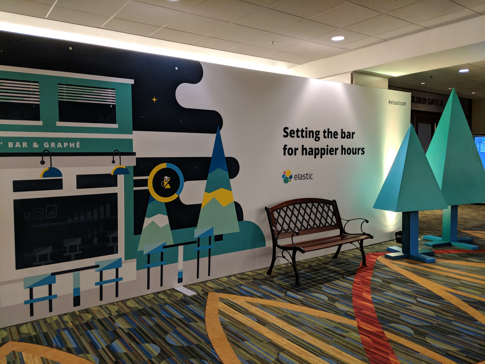

Roller coaster ride! 

Also, it still feels like I joined [Elastic](https://elastic.co) a month ago. Time just flies, and I could not believe it has been three years already. Being a developer myself, I always dreamt of helping/teaching developers. And with Elastic, that dream has come true. I never thought I'd work for a company like this. 

The story begins around July 2017. My colleague and then acquaintance referred me to Elastic, which was a relatively unknown brand to me except for the Opensource project Elasticsearch. 

Long story, short! I joined Elastic on November 28, 2017.

## The beginning

> Elastic is a great place to work at. It isn't just about benefits, pay, or perks. It is because of people that I love to work here. 

One of my managers often said any place isn't enough to work if you don't feel enthusiastic about going to the office and checking for mails every morning.

At Elastic, every day, I feel motivated going(starting!) to work over the last few years. It is indeed remarkable to see the opportunity to create an impact, help people and still realize there is room for improvement :D

## Work Culture

In my view, Elastic has unparallel work culture. Few perks like `Covid` leave & `Shut-it-down` Fridays when the pandemic hit us hard, when we're all suffering from Digital fatigue made me so happy that I could spend time relaxing. 

During the interview process, my hiring manager took the interview in a true informal fashion. I realized I'm in for something different. Open culture is new to me. It is overwhelming in a way and took time for me to comprehend information. Senior leaders are very approachable. Your opinion is valued! 

Elastic is a distributed workplace with many engineers working from home without seeing each other in-person for about six months. But when we meet, we endlessly discuss work, life, and several other things.

**Shay** does AMA's internally, and in one such meeting, he mentioned that `Work is part of life,` but it is not a 50-50 balance you need to maintain. It is ok and essential at times to be flexible. Likewise, many other discussions with him are always enjoyable because I end up with net new knowledge. 

Everyone is given their choice of working style, provided you respect everyone's time and join meetings. You're never asked or mandated to work beyond working hours. I divide my day into work blocks, 2-2-3-2. Work for 2 hours in the morning, break for breakfast, work for 2 hours, then lunch, a continuous block of 3 hours, and a snack break and 2 hours. 

There is a ton of opportunity to work and learn from others, being in an extremely collaborative space. I have learned a lot working with several Sales leaders, Engineers, Product Leads.

## The Work itself

Elastic's technology is so powerful in helping organizations solve many problems. Be it for a dating app, analytics solution, or a threat hunting platform.

Due to the kind of role I play, I often travel, or I used to (pre-pandemic). Being in this role allowed me to interact with developers, Senior Leaders, Startup founders, and Tech Influencers. I spoke at 350+ developer events, including Conferences, Meetups, Panel discussions, Workshops, Interviews. 

I work with several affinity community groups, Elastic User Groups, Cloud Partners, and Educational Institutions in India and South East Asia. 

BTW, I could do many of these because of our fantastic Program Managers on the Team. They help us(Advocates) connect with Communities and curates what the community needs. 

## The Cons

Well, there are things we are getting better at. Elastic is growing tremendously, and some processes don't scale. We're continually improving on giving the best to our users, contributors, customers, and partners. 

That being said, I've confidence in the overall vision and direction. 

## Finally

In my view, one should never stop learning or stop taking challenging work. 

Elastic presents one with unique learning, delivering opportunity by keeping health & wellness in mind. I’m thankful to my colleagues for their support and help. 

