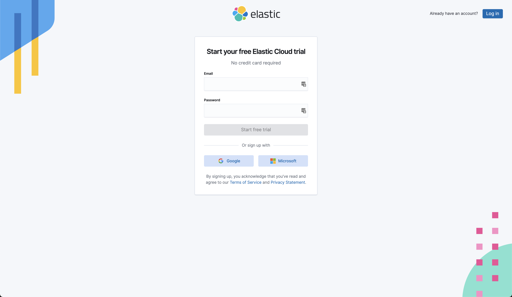
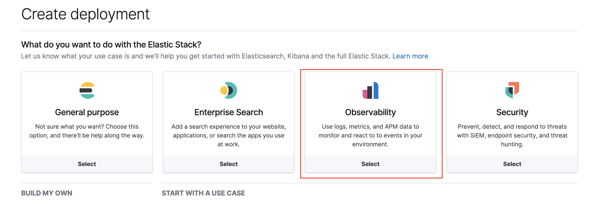
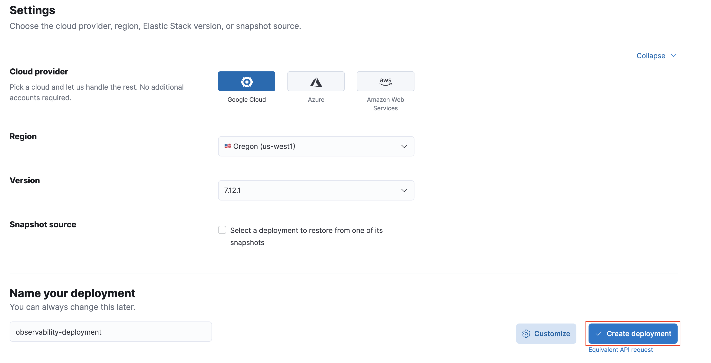
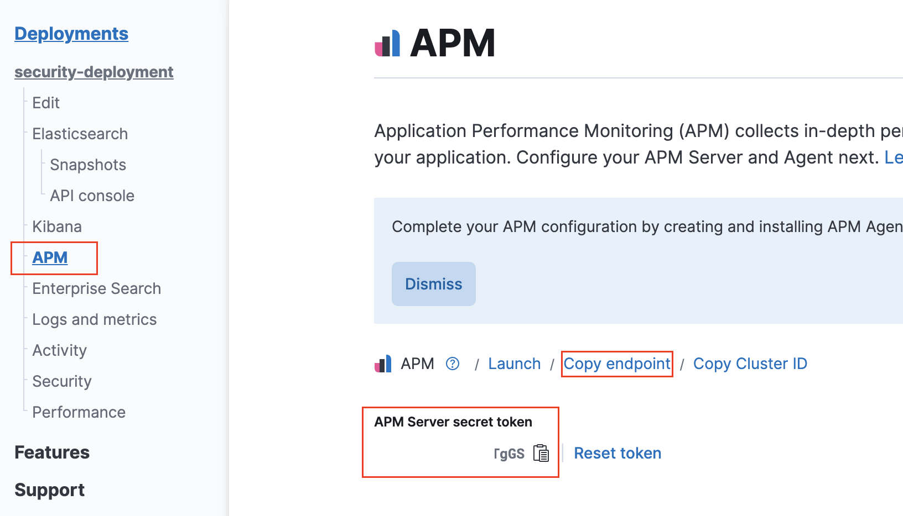
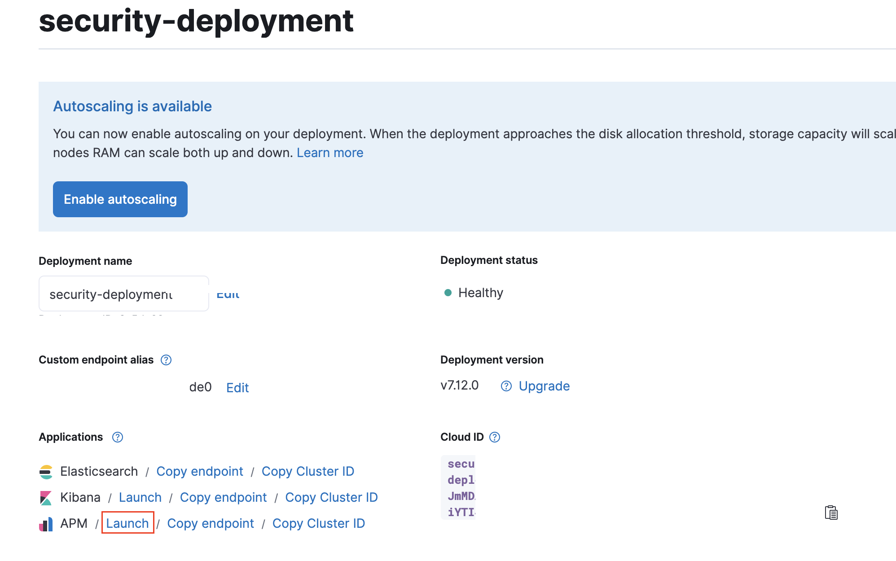

Sign up with your Google, MSFT or any email: 

Choose Observability 📊

Choose the cloud vendor and version of Elastic Stack and click on create deployment. 

After clicking on the left menu, copy APM endpoint and secret token. 

Once the application is starts, click on APM launch link from Elastic cloud console. It automatically logs on to the Kibana APM page. 

