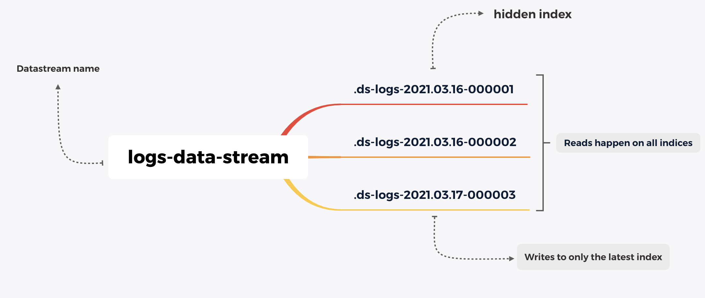

## Introduction

Elasticsearch, aka ELK stack, is the defacto home for devs doing log analytics for years. Besides, with tools like Metricbeat and APM, Elasticsearch became home for metrics and traces too. 

All these different data categories are stored in a simple index that lets you search, correlate and take action. I wrote at length about [Elasticsearch Index](https://aravind.dev/everything-index-elastic), and please refer if you are new to the concept. 

Timeseries data is voluminous and snowballs quickly. 

For example: For an average user, `syslogs` from MacBook pro might be anything from the range of 300mb-1Gb per day. Now multiply it with the number of days, it starts to look prominent.

### Can I neglect and store fewer amounts of data?

Well, yes. You can! 

But most teams store at least six months of data on Elasticsearch Cluster or even any on other platforms. It could be for various reasons — active data engineering work, gathering customer behavior trends, insights, etc. 

> Note: You could store data on Cloud Object Stores like S3, GCS, ACS and directly query it from Elasticsearch in a faster manner. This feature is called [Searchable Snapshots](https://www.elastic.co/guide/en/elasticsearch/reference/current/searchable-snapshots.html).

What folks do is time-based indexing, rolling over the data into a newer index based on time or size. If you are using Filebeat to ship logs, the index is rolled over to a new one daily or based on the size threshold by default. Data, when ingested through Filebeat, Filebeat manages the index rotation. 

Elasticsearch also has a concept called Aliases, which is a secondary name to an Elasticsearch index. Thereby, in time-series data indexing, you could always use the alias to query the latest data while indices keep rotating daily behind. You always refer to the latest one! 

### What's the problem?

For starters, there are a few.

- Managing the index rotation.
- Setting up the alias.
- Querying the data.

It might sound like everything I wrote in the previous paragraphs. 😅  For beginners looking to get started, they might feel scaling the Elasticsearch cluster data overwhelming with all these concepts. 

## Data streams

Logs, metrics, traces are time-series data sources that generate in a streaming fashion. 

Elasticsearch Data stream is a collection of hidden automatically generated indices that store the streaming logs, metrics, or traces data. It rolls over the index automatically based on the index lifecycle policy conditions that you have set. 

Data streams are like aliases with superpowers. The difference is you always write to one index while keep querying on the entire hidden collection of indices. 



### Difference between an Index and Data stream

A Data stream still contains a collection of hidden auto-generated indices. End of the day, data is still stored in Elasticsearch indices. 

### Some things to note:

1. Every document indexed into the Data stream should have a `@timestamp` field. Otherwise, it will be added by default.
2. Every data stream should have a backing index template (I wrote about index templates here.) An index template that is in use by a data stream cannot be deleted.
3. Cannot add new documents to other read-only indices.
4. Can update documents in older hidden indices only by update_by_query, delete_by_query. 
5. Cannot perform operations like clone, delete, close, freeze, shrink, split on a write index because these operations could hinder indexing. 

## Demonstration of Data streams

You need an Elasticsearch cluster to run below commands. You can spin up a cluster for free at [Elastic Cloud](https://cloud.elastic.co/registration?fromURI=%2Fhome) OR download the [Elasticsearch and Kibana](https://elastic.co/downloads). 

### Create a Data stream

```json
PUT _data_stream/first-data-stream
```

Executing the above query will give you the below response. 

```json
{
  "error" : {
    "root_cause" : [
      {
        "type" : "illegal_argument_exception",
        "reason" : "no matching index template found for data stream [first-data-stream]"
      }
    ],
    "type" : "illegal_argument_exception",
    "reason" : "no matching index template found for data stream [first-data-stream]"
  },
  "status" : 400
}
```

But why? As I wrote in the above section, every Data stream needs a matching index template. The current data stream which we intend to create doesn't have a matching index template. 

Let us create an Index template, beginning with what templates one needs

```json
PUT _index_template/my-index-template
{
  "index_patterns": [
    "my-*-*"
  ],
  "data_stream": {},
  "composed_of": [
    "logs-mappings",
    "logs-settings"
  ]
}
```

Now create a Data stream as per the given index pattern. 

```json
PUT _data_stream/my-data-stream
```

Notice that you are creating a data stream via `_data_stream` API. 

Try creating an index with the same name using create index REST API call. You will see the below error as the index template allows to create Data streams only. 

```json
PUT my-data-stream
```

```json
{
  "error" : {
    "root_cause" : [
      {
        "type" : "illegal_argument_exception",
        "reason" : "cannot create index with name [my-data-stream], because it matches with template [my-index-template] that creates data streams only, use create data stream api instead"
      }
    ],
    "type" : "illegal_argument_exception",
    "reason" : "cannot create index with name [my-data-stream], because it matches with template [my-index-template] that creates data streams only, use create data stream api instead"
  },
  "status" : 400
}
```

### Ingesting Data into Data stream

A data stream is append-only. You can only write data to the new index that the Data stream is pointing to. `create` is only `op_type` supported. 

```json
POST my-data-stream/_doc 
{ 
  "@timestamp" : "2021-05-17T11:04:05.000Z", 
  "username": "aravindputrevu", 
  "message": "created new record in new data stream" 
}
```

The below response shows the index name to which the data is indexed.

```json
{
  "_index" : ".ds-my-data-stream-2021.04.03-000001",
  "_type" : "_doc",
  "_id" : "ibaqlngBBRKAWM-s4QBK",
  "_version" : 1,
  "result" : "created",
  "_shards" : {
    "total" : 2,
    "successful" : 2,
    "failed" : 0
  },
  "_seq_no" : 0,
  "_primary_term" : 1
}
```

### Searching/Querying a Data stream

While querying a Data stream, you query all the hidden indices backing it. Of course, you could manage the indices using an Index Lifecycle Management Policy. 

```json
GET my-data-stream/_search
```

```json
{
  "took" : 278,
  "timed_out" : false,
  "_shards" : {
    "total" : 1,
    "successful" : 1,
    "skipped" : 0,
    "failed" : 0
  },
  "hits" : {
    "total" : {
      "value" : 1,
      "relation" : "eq"
    },
    "max_score" : 1.0,
    "hits" : [
      {
        "_index" : ".ds-my-data-stream-2021.04.03-000001",
        "_type" : "_doc",
        "_id" : "ibaqlngBBRKAWM-s4QBK",
        "_score" : 1.0,
        "_source" : {
          "@timestamp" : "2021-05-17T11:04:05.000Z",
          "username" : "aravindputrevu",
          "message" : "created new record in new data stream"
        }
      }
    ]
  }
}
```

### Rolling over to a new index

Rollover API lets you manually roll over the Data stream to a new write index.

```json
POST my-data-stream/_rollover
```

Let us ingest a new document to see which index it will be indexed.

```json
POST my-data-stream/_doc 
{ 
  "@timestamp" : "2021-05-17T11:04:05.000Z", 
  "username": "aravind", 
  "message": "created new record in new index" 
}
```

```json
{
  "_index" : ".ds-my-data-stream-2021.04.03-000002",
  "_type" : "_doc",
  "_id" : "eXjBlngBMEZuBoEtxmk2",
  "_version" : 1,
  "result" : "created",
  "_shards" : {
    "total" : 2,
    "successful" : 2,
    "failed" : 0
  },
  "_seq_no" : 0,
  "_primary_term" : 1
}
```

### Data stream naming convention

For clear identification, Elastic recommends using a Data stream naming convention, which helps us to identify the dataset, datatype, and data source. 

```json
<type>-<dataset>-<namespace>

```
For example: if we are ingesting Redis server logs from a production deployment. To create a Data stream, according to the convention, it looks like below.

```json
PUT _data_stream/metrics-redis-server-production
```

Elastic agent ships logs, metrics from various data sources (aka integrations) in a similar Data stream naming convention.  

Note: Elasticsearch ships by default with default index templates that match patterns logs-*-*, metrics-*-*, and synthetics-*-*. 

### Update/Delete data in a Data stream

You can only update the data in a Data stream backed indices via `_update_by_query`  or  `_delete_by_query` API.

  

```json
POST my-data-stream/_update_by_query 
{ 
  "query": { 
      "match":{ 
        "username": "aravindputrevu" 
        } 
      }, 
      "script": { 
       "source": "ctx._source.username = params.new_username", 
         "params": { 
           "new_username": "aravind" 
          }
        } 
}
```

### Statistics from a Data stream

`_stats` endpoint offers an incredible amount of insight into what's happening inside an Elasticsearch Data stream or each of its backing indices. You can find out details like the number of open search contexts, query cache size, etc. 

```json
GET _data_stream/my-data-stream/_stats/
```

### Delete a Data stream

Deleting a Data stream will delete all the hidden backing indices. 

 

```json
DELETE _data_stream/my-data-stream
```

In a crux, Data streams are the new indexing strategy for ingesting logs, metrics, synthetics data into Elasticsearch. It still offers many benefits like granular data control, reduced number of fields per index, which we did not discuss in this article.  

Have questions about Elasticsearch or Data streams? You could reach out to me on [Twitter](https://twitter.com/aravindputrevu) or [Linkedin](https://linkediin.com/in/aravindputrevu), happy to help!