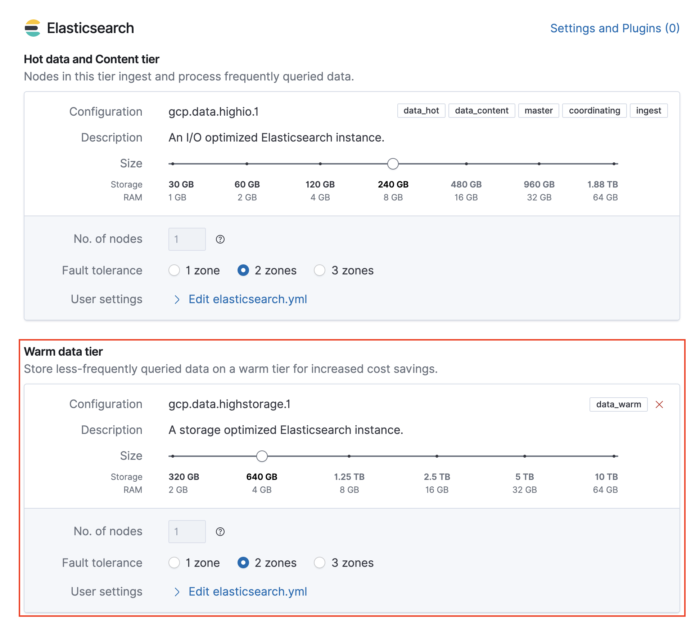
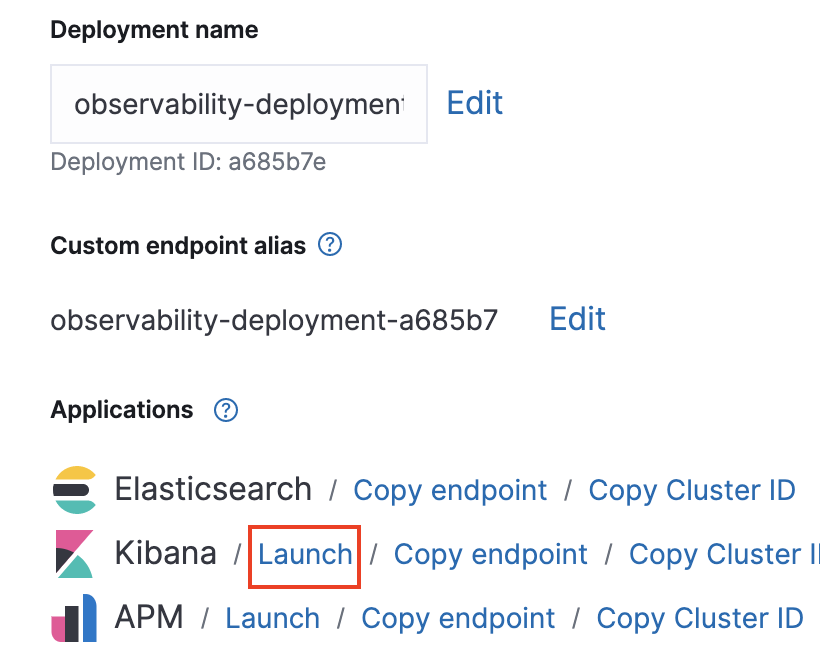
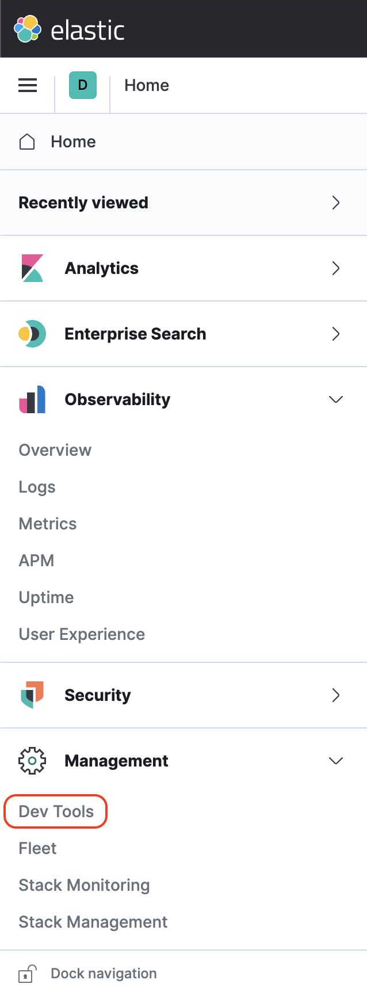

Everything in Elasticsearch goes to an Index. The data, settings of various Kibana dashboards, monitoring information of Elasticsearch cluster. 

An Index plays a vital role, and duly there is a specific need for managing the data stored in an Index. Index Lifecycle Management has released a beta feature in Elasticsearch 6.6, later GA'ed in 6.7. 

There were projects like [Curator](https://github.com/elastic/curator) used to do the data management part for Elasticsearch. It gained fame in less time. Curator is not maintained anymore. 

> Note: Curator is deprecated and not actively maintained anymore.

### Index Lifecycle Management

Index Lifecycle Management is like a cron job applied to indices. 

Somethings to remember

- ILM is applied on indices using ILM policies.
- ILM policies contain information that takes action on data based on the threshold guidelines mentioned in the policy.
- ILM policies contain phases (hot, warm, cold, delete). You can perform specific actions along with the data transition, like reducing the number of primary shards and taking a snapshot.

### Test driving ILM

[Elastic.co](http://elastic.co) has detailed ILM [documentation](https://www.elastic.co/guide/en/elasticsearch/reference/current/index-lifecycle-management.html). In this blog post, we'll see how ILM works. I want to show how data could be transitioned from one phase (tier: hot) to another (tier: warm). 

#### Prerequisites: 

- Create a free Elastic Cloud account [here](https://cloud.elastic.co/registration).  Spin up an Observability deployment with a warm tier → launch Kibana → Head to "Dev Tools" in the left menu. Refer to screenshots [here](#elastic-cloud-account-creation  ).
- We'll be using Data streams. If you are new to the concept, please refer to [data streams blog post](https://aravind.dev/elastic-data-stream/). Data streams are nothing but Elasticsearch aliases with superpowers with hidden auto-generated indices backing them.


Alternatively, you can [download](https://elastic.co/downloads/elasticsearch) and build a two-node Elasticsearch cluster with a `node.role`mapped as `data_hot` and `data_warm` and [spin a Kibana](https://elastic.co/downloads/kibana) optionally if you want to try the ILM UI.

#### Create an ILM Policy

I'm creating an ILM policy named `my-ilm-policy` with thresholds to rollover the data to the next phase. The policy is configured to move data to the warm phase from the hot phase when the maximum age is set to two minutes OR two kilobytes, OR a maximum number of docs are two per index.  

> Note: Phases indicate nodes with different hardware performance capabilities and node attributes marked as `data_hot`, `data_warm`, etc.

```json
PUT _ilm/policy/my-ilm-policy
{
  "policy": {
    "phases": {
      "hot": {
        "actions": {
          "rollover": {
            "max_age": "2m",
            "max_size": "2kb",
            "max_docs": 2
          },
          "set_priority": {
            "priority": 100
          }
        },
        "min_age": "0ms"
      },
      "warm": {
        "min_age": "0d",
        "actions": {
          "set_priority": {
            "priority": 50
          }
        }
      }
    }
  }
}
```

#### View the ILM policy

```json
GET _ilm/policy/my-ilm-policy
```

#### Create the Index Template

Data stream needs a matching index template to create a data stream and hidden backing indices. Also, even if you apply ILM policy to an index, it is good to do it via an index template.

Below, we create an Index template; notice the ILM policy attached as part of Index settings. You can also see, the [composable index templates](https://aravind.dev/everything-index-elastic/#templates) `logs-mappings` and `logs-settings`.

```json
PUT _index_template/my-index-template
{
  "template": {
    "settings": {
      "index": {
        "lifecycle": {
          "name": "my-ilm-policy"
        }
      }
    },
    "mappings": {
      "dynamic": true,
      "numeric_detection": false,
      "date_detection": true,
      "dynamic_date_formats": [
        "strict_date_optional_time",
        "yyyy/MM/dd HH:mm:ss Z||yyyy/MM/dd Z"
      ],
      "_source": {
        "enabled": true,
        "includes": [],
        "excludes": []
      },
      "_routing": {
        "required": false
      }
    }
  },
  "index_patterns": [
    "my-index-*"
  ],
  "data_stream": {},
  "composed_of": [
    "logs-mappings",
    "logs-settings"
  ]
}
```

#### Change the poll interval

By default, ILM checks all indices for every ten(10) minutes and sees if any index meets the criteria according to the ILM policy. To see results quickly, let us reset it to run for every fifteen(15) seconds. 

```json
PUT _cluster/settings
{
  "transient": {
    "indices.lifecycle.poll_interval": "15s"
  }
}
```

#### Create the data stream

Below API calls look like creating an index `my-index-ilm`, but it creates a data stream backed by a hidden auto-generated index. 

```json
POST my-index-ilm/_doc
{
  "@timestamp": "2021-04-11",
  "username": "aravind",
  "message": "This is ILM Demo "
}

POST my-index-ilm/_doc
{
  "@timestamp": "2021-01-11",
  "username": "aravind",
  "message": "This is 2nd ILM Demo "
}

POST my-index-ilm/_doc
{
  "@timestamp": "2021-04-11",
  "username": "aravind",
  "message": "This is 3rd ILM Demo "
}
```

#### List, refresh the documents ingested

```json

GET _cat/indices/my-index-ilm?v

POST my-index-ilm/_refresh
```

#### View documents ingested

```json
GET my-index-ilm/_search
```

#### Explain the ILM status

Explain API gives detailed information on actions taken on the index. 

```json
GET my-index-ilm/_ilm/explain
```

For example, executing the above request gives you a response like this.

```json
{
  "indices" : {
    ".ds-my-index-ilm-2021.04.10-000001" : {
      "index" : ".ds-my-index-ilm-2021.04.10-000001",
      "managed" : true,
      "policy" : "my-policy",
      "lifecycle_date_millis" : 1618076137017,
      "age" : "9.7s",
      "phase" : "hot",
      "phase_time_millis" : 1618076137113,
      "action" : "rollover",
      "action_time_millis" : 1618076137249,
      "step" : "check-rollover-ready",
      "step_time_millis" : 1618076137249,
      "phase_execution" : {
        "policy" : "my-policy",
        "phase_definition" : {
          "min_age" : "0ms",
          "actions" : {
            "rollover" : {
              "max_size" : "2kb",
              "max_age" : "2m",
              "max_docs" : 2
            },
            "set_priority" : {
              "priority" : 100
            }
          }
        },
        "version" : 1,
        "modified_date_in_millis" : 1618066566215
      }
    }
  }
}
```

#### Check ILM roll over 

We've ingested three (3) docs and ran refresh. After fifteen (15) seconds ILM should run and rollover the index to the warm tier from the hot tier. If you don't even ingest data, ILM will keep rolling over the active index when it meets the two-minute criteria. 

```json
GET _cat/indices/my-index-*?v
```

### How to find where the Data has moved?

I have been talking about hot tier and warm tier, that is, nothing but two nodes designated with `data_hot` and `data_warm`; `node.role` attributes. 

If you want to take a detailed look at how and where the indices have moved, please turn on Stack monitoring in Kibana and head over to nodes → indices. 


If you need more help with ILM or have questions, please write a comment below or DM me on [Twitter](https://twitter.com/aravindputrevu), [Linkedin](https://linkedin.com/in/aravindputrevu). Follow me on Twitter for more exciting updates! 

### Elastic Cloud Account creation

Sign up with your Google, MSFT or any email: 


Choose Observability 📊


Click on Customize after choosing the region and cloud provider of your choice.


Click on "Add capacity."


Notice the warm data tier that got added



Click on "Create deployment." 


Click on "Launch" to authenticate into Kibana.



Open the left menu → Management → Click on Dev Tools.

