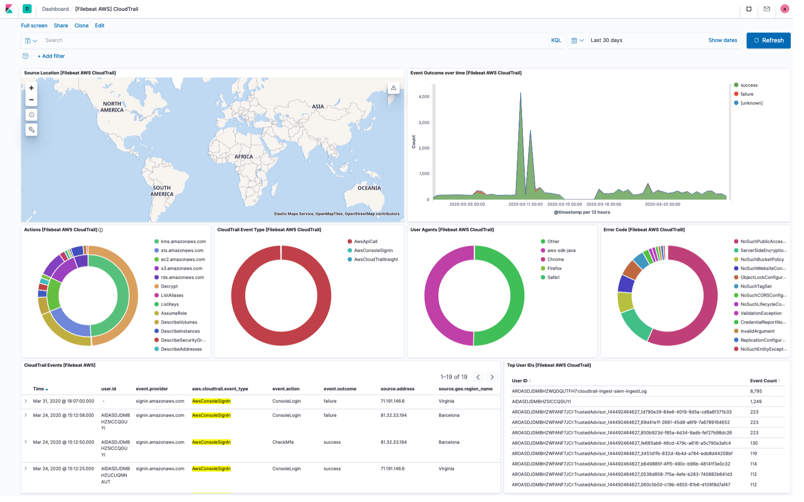
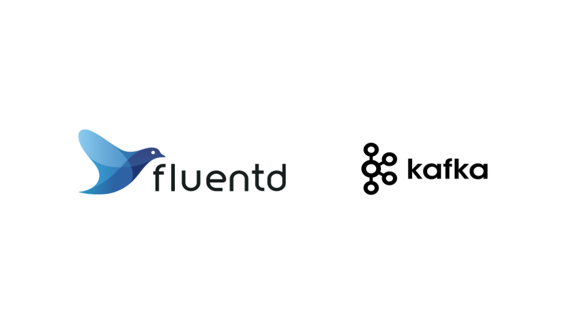
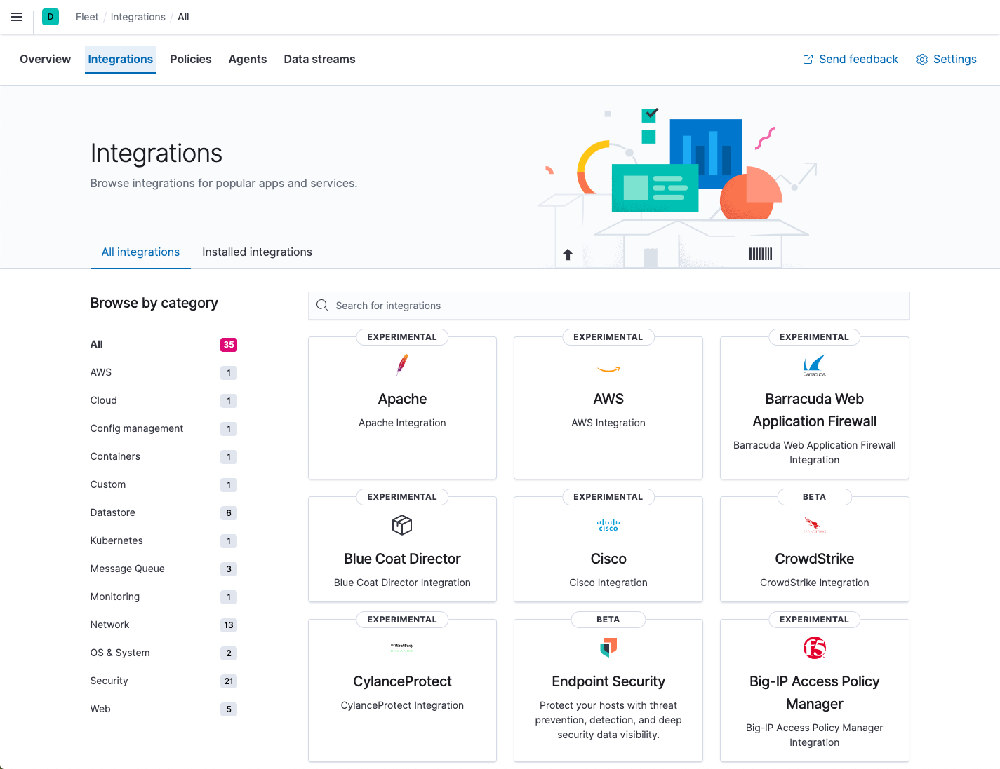

Often people ask me how to get a specific type of data into Elasticsearch. As the number of use cases and popularity grew, there are also many ways to ingest the data. There are [integrations](https://elastic.co/integrations) that are designed to sanitize & ingest the data by making it ready for analysis, or the data can be consumed directly via the APIs.

In this blog, I will explain _seven_ ways to ingest data into Elasticsearch in 2021.

## Elasticsearch API

Elasticsearch offers to [Create](https://www.elastic.co/guide/en/elasticsearch/reference/current/docs-index_.html), [Read](https://www.elastic.co/guide/en/elasticsearch/reference/current/docs-get.html), [Delete](https://www.elastic.co/guide/en/elasticsearch/reference/current/docs-delete.html) and [Bulk](https://www.elastic.co/guide/en/elasticsearch/reference/current/docs-bulk.html) ingest [REST APIs](https://www.elastic.co/guide/en/elasticsearch/reference/current/rest-apis.html) to ingest data via a JSON body. Due to the API-oriented nature of Elasticsearch, today, we see a lot of systems that co-exist, integrate with it.

However, unless there is a specific need or use case, I don't think one should use Elasticsearch API directly and leverage other ways listed below.

## API Clients

Elasticsearch API is implemented in different programming languages. These are [Elasticsearch Clients](https://www.elastic.co/guide/en/elasticsearch/client/index.html). Suppose you want to build a NodeJS app with search functionality using Elasticsearch, you can use the [Javascript client](https://www.elastic.co/guide/en/elasticsearch/client/javascript-api/current/installation.html), which can communicate directly with Elasticsearch API. So, you write code using your favorite programming language. In fact, Kibana uses the same [elasticsearch.js](https://github.com/elastic/elasticsearch-js) client library to talk to Elasticsearch.

Here are some code samples from various language clients on how they connect with Elasticsearch.

### JavaScript

```jsx
const { Client } = require('@elastic/elasticsearch')
const client = new Client({
  node: 'https://localhost:9200',
  auth: {
    apiKey: {
      id: 'foo',
      api_key: 'bar'
    }
  }
})
```

### Java

```java
RestHighLevelClient client = new RestHighLevelClient(
        RestClient.builder(
                new HttpHost("localhost", 9200, "http"),
                new HttpHost("localhost", 9201, "http")));
```

> **Note:** There is an upcoming Elasticsearch Client that is going to replace the current REST Client. Do follow more updates in [this github repository](https://github.com/elastic/elasticsearch-java) 

### Python

```python
from elasticsearch import Elasticsearch
es_client = Elasticsearch()

sample = {
    'firstName': 'First Name',
		'lastName': 'Last Name'
}
response = es_client.index(index="data-ingest", id=1, body=sample)
```

## Beats

[Beats](https://elastic.co/beats) are the data shippers of Elasticsearch primarily used for DevOps use cases. Essentially there are seven (7) beats, each for a specific data source type like [Filebeat](https://www.elastic.co/beats/filebeat) for logs, [Auditbeat](https://www.elastic.co/beats/auditbeat) for audit data, [Metricbeat](https://www.elastic.co/beats/metricbeat) for metrics, and so on.


There is an added advantage to using beats as they set up the much-needed indices, Index Lifecycle policies, adds meta data. Each of these beats offers different supported data ingestion input types.

> **Tip:** I've written a blog about [ILM](https://aravind.dev/elastic-ilm-test/), do read if you are new and want to get started with ILM. 

Use beats if there is no beats module for the data source that you want to ship. For example, it could happen mostly for logs. Say you have application-specific logging, which might be custom to your organization. Then, you could use Filebeat to ship that logs.

Now, what are beats modules? Over to the next section 🙂

## Beats modules

Beats modules are a blessing in disguise. They help you sanitize and ship the data directly to Elasticsearch, creating relevant visualization assets in Kibana such as Dashboards. There are as many as 70+ beats modules that can send data from general-purpose software like [Kubernetes](https://www.elastic.co/guide/en/beats/metricbeat/current/metricbeat-module-kubernetes.html), [Apache](https://www.elastic.co/guide/en/beats/filebeat/current/filebeat-module-apache.html), [MySQL](https://www.elastic.co/guide/en/beats/filebeat/current/filebeat-module-mysql.html), [Redis](https://www.elastic.co/guide/en/beats/filebeat/current/filebeat-module-redis.html), [MongoDB](https://www.elastic.co/guide/en/beats/filebeat/current/filebeat-module-mongodb.html), [AWS](https://www.elastic.co/guide/en/beats/filebeat/current/filebeat-module-aws.html), [GCP](https://www.elastic.co/guide/en/beats/filebeat/current/filebeat-module-gcp.html), [Azure](https://www.elastic.co/guide/en/beats/filebeat/current/filebeat-module-azure.html) and so on.




## Logstash and its plugins

Initial days of Elasticsearch, Logstash is the only way to ship time-series data or from other systems. [Logstash](https://www.elastic.co/logstash/) also plays a vital role as an ETL engine, pulling data from so many sources, transforming/filtering them, and sending them to Elasticsearch.

More than [350 plugins](https://www.elastic.co/guide/en/logstash/current/input-plugins.html) in the Logstash ecosystem can pull data from a wide variety of data sources.

For example, you can pull data from an [S3 bucket](https://www.elastic.co/guide/en/logstash/current/plugins-inputs-s3.html), [transform](https://www.elastic.co/guide/en/logstash/current/plugins-filters-mutate.html) it, push it to [Elasticsearch](https://www.elastic.co/guide/en/logstash/current/plugins-outputs-elasticsearch.html). Similarly to that, syncing data from an [RDBMS](https://www.elastic.co/guide/en/logstash/current/plugins-inputs-jdbc.html).

However, I'd recommend you ship data using beats and use [ingest pipelines](https://www.elastic.co/guide/en/elasticsearch/reference/7.x/ingest.html) in Elasticsearch to run a simple transformation on the ingested documents. And, only use Logstash if you can't find a beats module or will not be able to install an agent like Filebeat!

## Other OSS connectors



As discussed initially, the API-oriented nature of Elasticsearch built a vast open source or third-party connector base.

> **Note:**  OSS Connectors are not maintained or managed by Elastic. They might not be using all the best practices (calling APIs), shipping data in a suitable format (ECS) that tools like Kibana could leverage.

**FluentD** - an OSS data collector for a unified logging layer using which you could ship logs to Elasticsearch.

**Kafka** - an event streaming platform, quite useful if you are looking to ingest event data from various sources. Kafka has an Elasticsearch Sink connector as well as a connector to push data to Elastic Cloud.

**OpenTelemetry** - Elastic has built integrations to consume data from other data systems or frameworks. One such recent integration is OpenTelemetry, an observability framework through which you can ship logs, metrics and traces.

**Framework connectors** - some frameworks might be using the language clients and building a native experience for developers building on Elasticsearch. For example, Spring Data Elasticsearch is one such project where it uses Elasticsearch java client but provides additional methods to query Elasticsearch.

## Elastic Agent

Last but not least, an Elastic Agent is a unified agent that can collect different data sources from other systems in the form of integrations. It also provides endpoint protection to the host system!

You can also manage the machines using the Fleet manager. Elastic Agent is in beta right now. It could replace multiple beats installed on your host. Do give it a try by downloading it from [here](https://www.elastic.co/downloads/elastic-agent) and don't forget to share the feedback :) 



You can contribute an integration to the Elastic Agent by following the guidelines mentioned in [this repository](https://github.com/elastic/integrations/blob/master/CONTRIBUTING.md).

## Still having doubts about choosing the way?

- If you are building a search feature for an Application in any language, use the API Clients.
- If you want to ship time-series data like logs, metrics — you should take a look at Beats modules first, then beats, Logstash plugins, finally, other OSS Connectors. For collecting application traces, start with native [Elastic APM libraries](https://www.elastic.co/guide/en/apm/agent/index.html).

If you have more questions, please comment below.