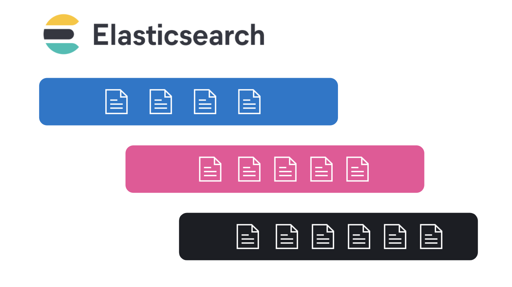
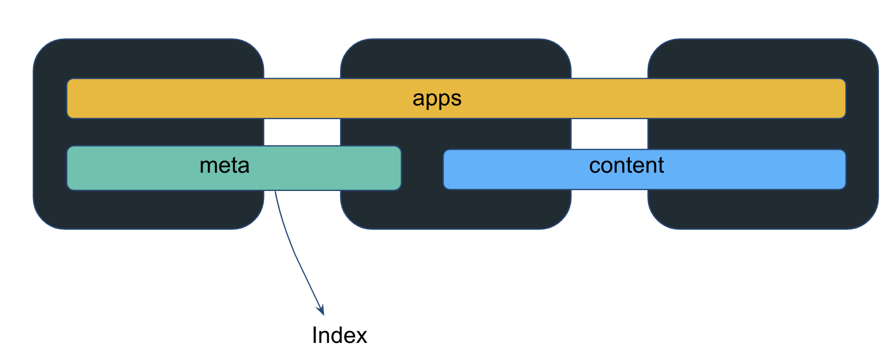
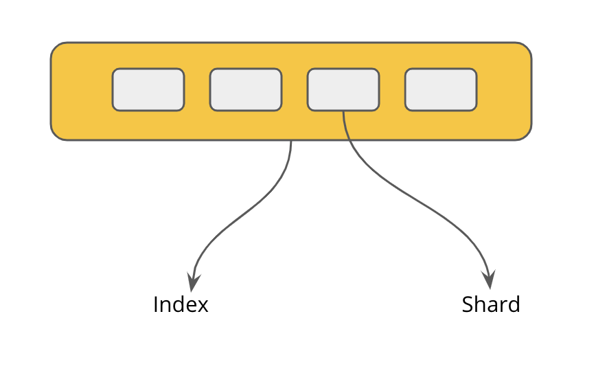
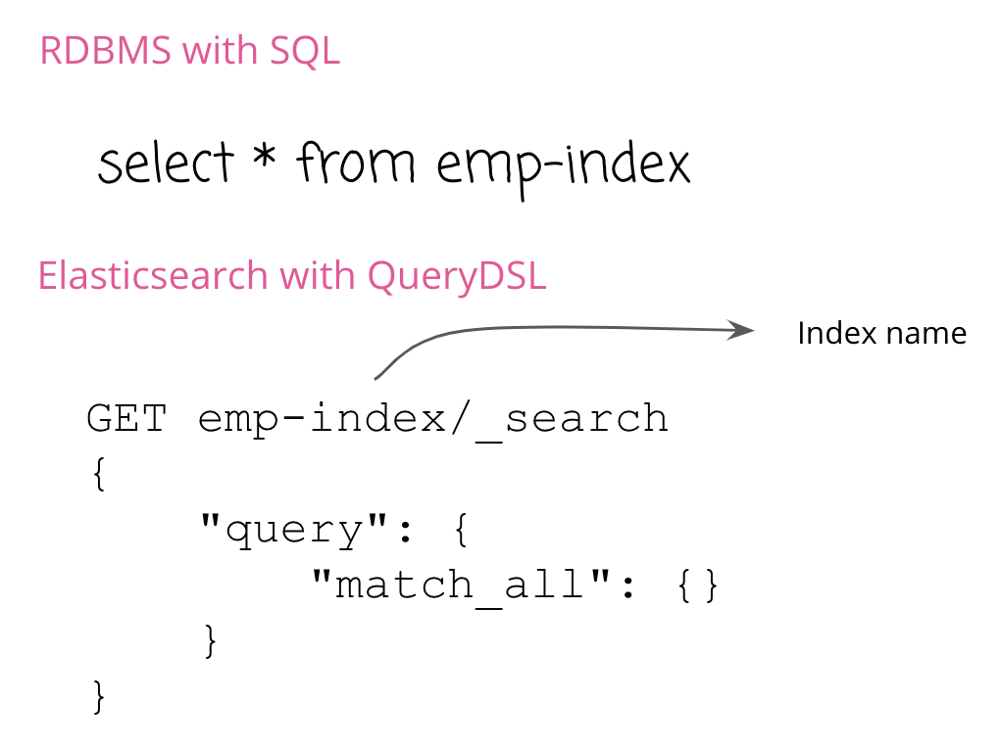
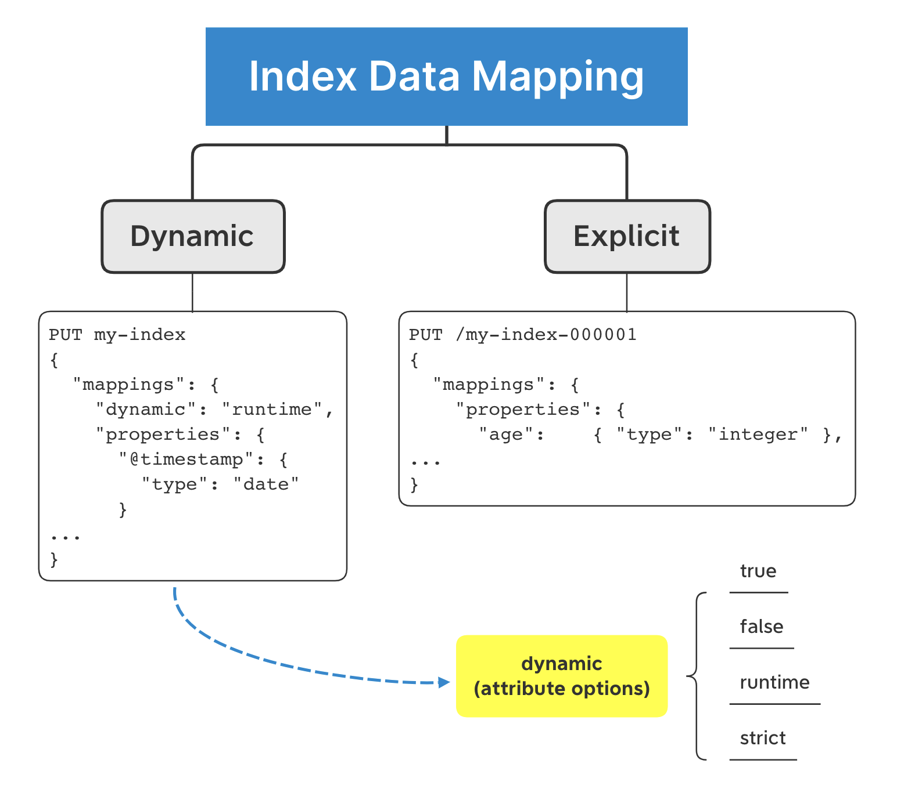
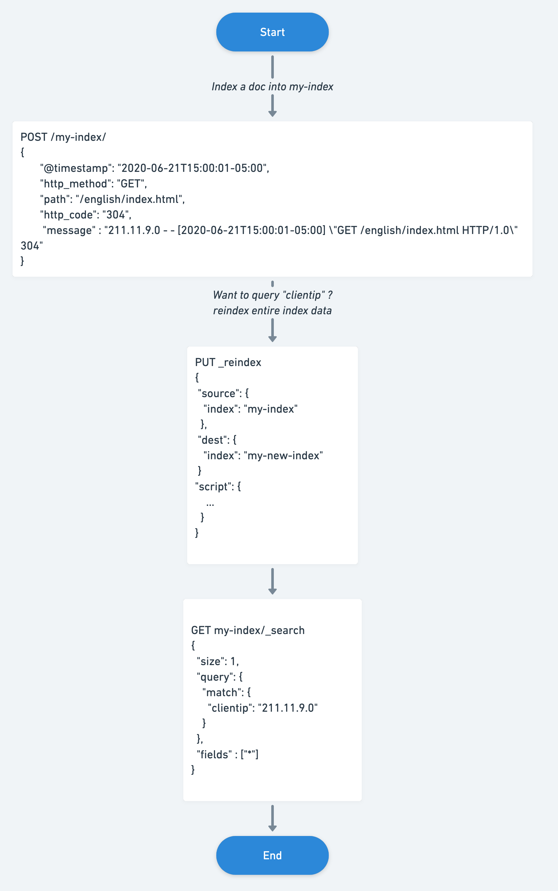
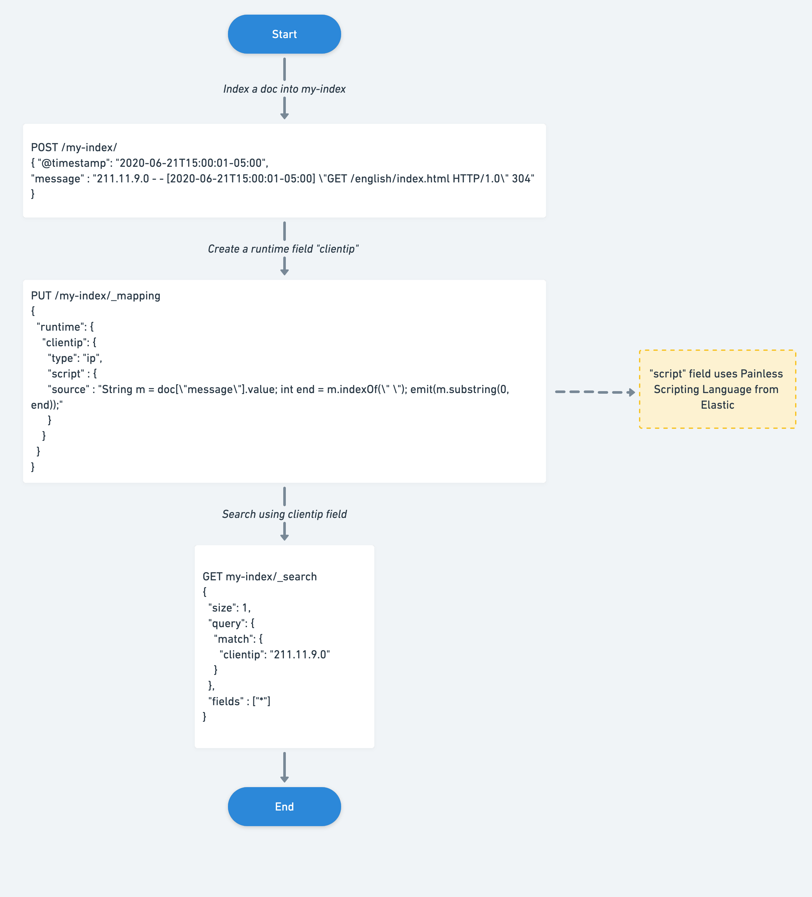
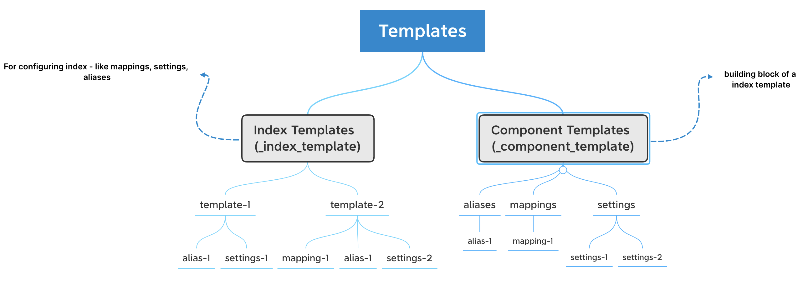
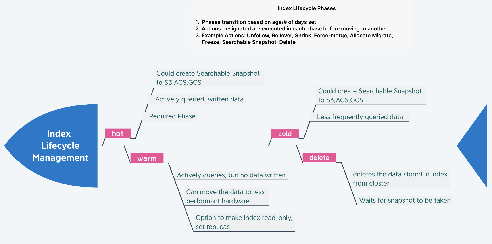
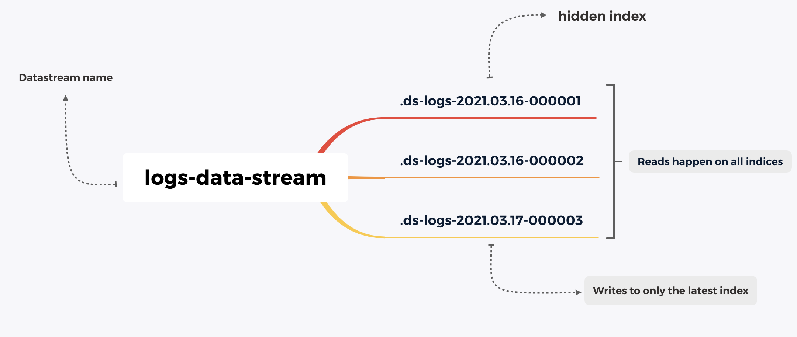

## What is Index?

Elasticsearch is a distributed Search engine. The data is stored and spread across various nodes. Indexes are the ones that hold that data *logically* (physical data is in shards). 

## What is so special about it?

> RDBMS : Table :: Elasticsearch : Index

All the APIs are addressed to an index, just like all queries are on the table.

One can query multiple indices too. 

> Note: Elasticsearch accepts multiple query languages like SQL, EQL, and QueryDSL to query data in the indices.

## Index naming rules

 - Lowercase only 
 - Cannot include `\`, `/`, ``, `?`, `"`, `<`, `>`, `|`, ` ` (space character), `,`, `#`
 - Indices prior to 7.0 could contain a colon (`:`), but that has been deprecated and will not be supported in 7.0+
 - Cannot start with ``, `_`, `+`
 - Cannot be `.` or `..`
 - Cannot be longer than 255 bytes (note it is bytes, so multi-byte characters will count towards the 255 limit faster)

> Note: One will still see indices starting with `.` because of system indices like .security, .kibana, or Indices created by a Data stream, Elastic App Search, or Elastic Agent. These are system indices. 

## Index naming strategy

For time-series data such as logs, metrics, traces., Elastic's Beats or Logstash, write data into Elasticsearch with default index names like `filebeat-0001` or `logstash-%{+yyyy.MM.dd}`. It automatically increments the index name after a specific data limit. These defaults also help in managing data with other features like Index/Snapshot Lifecycle Management Policies.

If one has a strong opinion about creating indices with naming strategies, go ahead to create your own, but think about the scaling strategy. 

Keeping with defaults helps one can correlating the data (ECS) easily and leverage all the inbuilt features.  

**Note:** For search engines, the index name can be anything like, for example, products, hospitals_inventory.

## Categories of Data stored in Indices

 Indices store different data categories, although, remember, each data has a different volume, tenure. 

- Time series (Data indexed in the order of time)
    - Logs
    - Metrics
    - Traces
    - Security Events
- Content
    - PDFs, Spreadsheets, PPT's etc
    - Data from RDBMS

**Note:** Everything is a JSON document in Elasticsearch. Be it logs, metrics, traces, PDFs, PPT's. There are libraries or ingestion tools like [Beats](https://www.elastic.co/beats/), [Logstash](https://www.elastic.co/logstash), [Language Clients](https://www.elastic.co/guide/en/elasticsearch/client/index.html) to help with that. 

## Index Data Mapping

Perhaps, the most critical section in this blog. 🙂

Elasticsearch prepares the data for search/query operations while ingesting the data. It is also called "Schema on Write." It is like creating the schema dynamically/explicitly while defining inserting the record in a SQL Table.

One can also do "Schema on Read," which means preparing or fetching the data while querying with Runtime fields.

#### Dynamic

It happens on the fly as and when we ingest the data. It can be set to false, true, runtime, strict.

It means one can enable or disable the dynamic mapping even make it `strict` to follow a specific set of schema, otherwise reject the client's documents for ingestion.

#### Explicit

 - Can be set like an RDBMS Table while creating the index
 - Once defined, it can only be changed based on the mapping parameters.
 - If needed to change, data needs to be reindexed.
    - **Method 1:** One could use an alias for a field name and swap to new fields, deprecating the documents' old field.
    - **Method 2:** Create another index with the desired field data type + existing fields in the document, field names, then reindex the data.

Elasticsearch attempts to index all of the fields client sends, but sometimes if you don't want specific fields to be indexed, set `enabled` field to `false` and those fields will not be prepared for querying (can also be called not-indexed, unindexed). 

> Note: enabled setting can be applied at the top level for the entire document that client sends in OR to the field which contains `object` data type.

## Mapping Explosion

A mapping explosion occurs when a document has too many fields in an index. 

Imagine 20 different teams (each team coding for a microservice of the more significant application) using the same Elasticsearch cluster and pushing their application logs to the same index. 

Now each development team might be coding in a different programming language, and the language itself might have a different logging structure based on the logging framework used. 

Thus, each team might have a different log schema and fields, creating too many fields for a doc in the same index. It is like one SQL table having more than 1000 columns. 

So, how many recommended fields per doc in a single index? 1000 fields are the max limit. 

Of course, by modifying the `index.mapping.total_fields.limit` setting field limit can be changed.

It also does not mean Elastiscearch is unable to handle more data.  Keep all the data in `_source` field and use something like *runtime* fields if you want to query data. 

To effectively avoid all this, few suggestions.

#### Observability/Security (Timeseries data):

Elastic has the Elastic Common Schema (ECS) project, which also ships logging library frameworks. Devs can use that to automatically align logs from various sources into a co-relatable schema and standard data shippers like Filebeat. ECS logging libs also allow correlating the logs easily. 

#### Search Engine:

Teams building Search usually know what the user is going to search. So, optimizing the results to be queried by the user gives a considerable boost. Finalize the schema before going to production. 

For example, to build a phone number search functionality, we know that the phone numbers are not used for numerical calculations like addition, subtraction.  One could index all the phone numbers with the `keyword` data type. This schema change helps in boosting the search performance. 

## Runtime Fields:

Elasticsearch uses the "Schema on Write" methodology, which enables faster querying, better visualizations. However, if unindexed data in the `_source` needs to be queried later, you need to reindex to bring that data into a field. 

From 7.11, Elastic introduced Runtime fields which help add fields without reindexing the data. Also, many times one cannot predict what the document structure will be in the future. 

To create a runtime field, change the dynamic parameter to runtime when defining a field, add a runtime section in mappings, and define it directly in the search request. 

> Note: Runtime fields use less disk space and provide flexibility in accessing the data but can impact search performance based on the runtime script's computation.

## Templates

There are two types of Templates in Elasticsearch: Index Templates, Component Templates.

Index templates are settings that get applied when an index with a specific pattern gets created, for example, logs-* or app-*.

Index templates contain settings like how many shards and replicas the index should initialize with, what mapping settings, aliases to use. One can also assign priority to the index template. 100 is the default priority. 

Component templates are nothing but building blocks for index templates. Create an alias component template, settings component template, or a mapping component template and use them via the "composed_of" parameter. 

Elastic has built-in index templates which maps to index/datastream patterns `logs-*-*`,`metrics-*-*`, `synthetics-*-*`, which have default priority of 100. To create index template's which overrides the built-in index templates but use the same patterns, assign a priority that is above 100. To disable the built-in index and component templates, set the `stack.templates.enabled` to `false`

## Index Lifecycle Management (ILM)

Index Lifecycle management helps manage all data in the indices, leverage the underlying hardware capabilities. Time-series Data has different tenures, and only a sizeable chunk needs to be actively queried all the time.

> Note: Many users used to use curator, which more or less has similar functionality.  Curator is deprecated and not actively maintained. Please use ILM. 

ILM has policies that are instructions configured to execute on indices containing data. These instructions are like triggers that create, rollover, deletes data based on set conditions. There can be multiple ILM policies with different priorities set. 

For example, if you are ingesting 1 GB, logs, metrics, and traces data from the apps and infrastructure. By the end of the month, it becomes 30 GB, quarter: 90 GB, An year: 360+ GB. 

You might not need entire raw data to gather insights, as it does not change with time, but you might be interested in comparing trends. With ILM, you could gather critical insights and rollover the raw data to less expensive hardware-based nodes or delete the cluster's unneeded data. 

Besides, using the data tiers (hot, warm, cold), you could move the index data to designated nodes and have faster hardware for faster performance. ILM automates this entire process of moving data to different types of nodes. 

You could also configure ILM Policies to snapshot data to a cloud object store like S3, GCS, ACS. 

> **Note:** Kibana offers a comprehensive UI to configure ILM policies and manage data in indices. ILM is also available as an API. 

## Analyzers

Every index in Elasticsearch has an analyzer that analyzes the fields marked as `text` in the field mapping. Standard is the default analyzer in Elasticsearch. An analyzer is a combination of Character Filter, Tokenizer, Token Filter. Elasticsearch offers different built-in analyzers like Simple, Whitespace, Keyword, Language. 

There are 40+ language analyzers for Elasticsearch. That means one can search 40+ languages using Elasticsearch. The analyzer is a core topic and a fascinating one. It warrants a separate blog post for sure. 

The analyzer is configured via the PUT index settings API. You can test how the data is stored via `_analyze` API. 

## What is the future for time-series indexing?

To further simplify time-series data indexing and management, Elastic introduced a concept called **Data streams**. Data streams are a collection of hidden indices created and managed entirely by Elasticsearch. 

Essentially, the client does not talk to an index but to a Data stream for everything. Each Data stream should have a matching index template which is made up of component templates (index setttings, mappings, aliases). 

Data streams are integrated into all the concepts explained above in the blog post, such as ILM, index settings, index templates. 

Thanks for reading it through. If you have specific questions, reach me out at [Twitter](https://twitter.com/aravindputrevu) or ask your question below :D 

