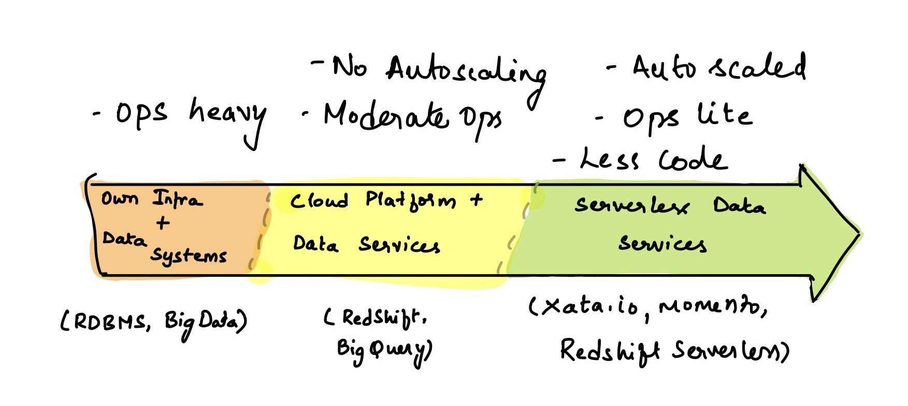

Last weekend, I came across this company called [Momento](https://www.gomomento.com/), a Serverless Cache service. Their website shows how other popular services like AWS DynamoDB, AWS S3, Google Cloud Run, and MongoDB Atlas are missing a piece which they are full-filling with Momento.

I liked the simplicity of the messaging. Without too much jargon, clearly explained the service. And, to be frank, it is easy to describe a Serverless product because mostly it is SaaS. You have to write a few lines of code and get charged for daily calls or runs. That's it!

And this is not the first time I've heard about Serverless backend services. For example, I've come across [xata.io](http://xata.io/) - the serverless database that feels like a spreadsheet.

Years ago, I was speaking to my friend, fellow community leader [Jeevan Dongre](https://www.linkedin.com/in/jeevandongre/). He just started his company [AntStack](http://antstack.io/), which does Serverless Consulting. Jeevan is bullish about the Serverless boom everywhere.

Fast forward, I think we're now getting there.

## Why Serverless backend services?

1. It is so simple to develop and get to production. IMO, Developers overwhelmingly like simplicity and hate redundancy in any task. Serverless backends solve the problems but also promise reliability and scalability. AWS Lambda execution environment is so famous for the same reason.
2. Serverless also helps do away with heavy ops work.

Serverless doesn't end at being only SaaS. There are Opensource projects too, which lets you run serverless services in-house. But, for now, these are "compute environments" and not a serverless DB/Cache. Infact, there is a study from McKinsey about [Serverless, Opensource & SaaS](https://www.mckinsey.com/business-functions/mckinsey-digital/our-insights/saas-open-source-and-serverless-a-winning-combination-to-build-and-scale-new-businesses) is going to be a winning combination.

For example, [fission](http://fisssion.io/), [OpenFaaS](https://www.openfaas.com/), [and Nuclio](https://nuclio.io/) are Opensource Serverless function-based computing platforms.

I find Serverless messaging penetrating most backend systems. But, I don't know how far it will be as simple as it is marketed and configurable to each use case. Because Dev Tools, Databases often start with a small use case and end up having a lot of bells and whistles by the time it reaches an enterprise customer or F500, thereby losing the benefit of simplicity :)

Currently, organizations are making developers develop a habit/norm to use Serverless services, just like Cloud yesteryear. More and more indie devs have already started to use Serverless backend services, followed by some startups. And if the trend continues, we will see most traditional DBs launch a serverless version.

Noting, this might not be for everyone, and the traditional RDBMS SQL DB market is so vast. I even guess most of the corporates or financial institutions like American Express still have developers working on Mainframes, with Oracle/Microsoft sales, trying to convert them 😂

And, there will be scores of people with complex use cases ready to run backends on Kubernetes like platforms.

**Edit:** Right when I started to publish this blog, I heard that AWS launched a Redshift Serverless preview :P speak of the devil.